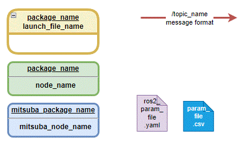
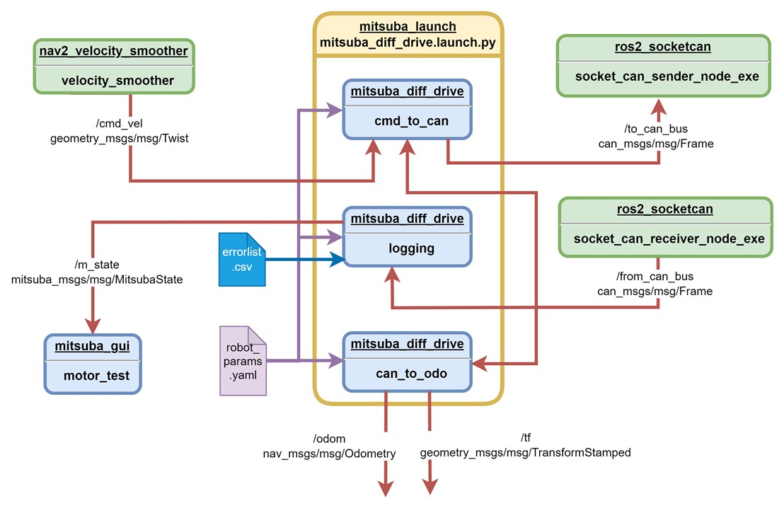
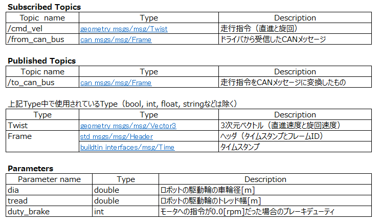
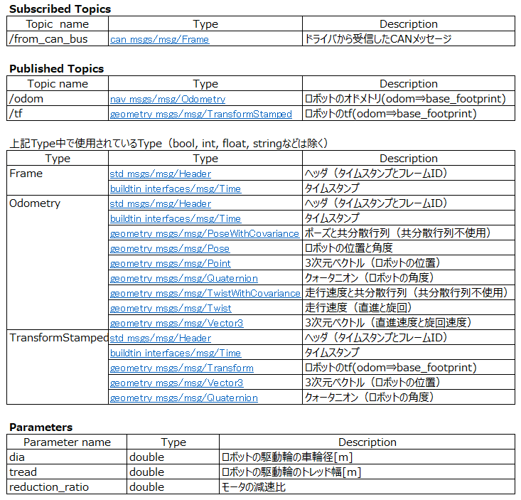
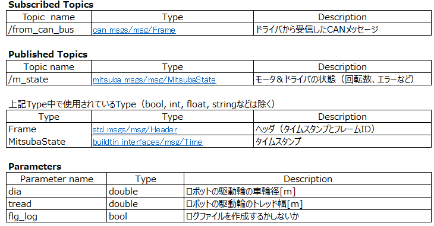

# ミツバ - 移動ロボット用ソフトウェア

## ミツバオリジナルパッケージ  mitsuba_diff_drive

### ファイル構成

### ROS2ノードブロック図  
  図にROS2ノードブロック図を示す。黄色いブロックの1行目にパッケージ名、2行目にlaunchファイル名を示している。黄緑  
  色と水色のブロック中の1行目にROS2のパッケージ名、2行目にノード名を示している。矢印上のテキストの1行目にトピック  
  名、2行目にメッセージ型を示している。黄緑色のブロックは既存ソフト、水色のブロックはオリジナルソフトを示している。
  
  
### ノード仕様  
* cmd_to_can  
  cmd_to_canノードは/cmd_velトピックの走行指令メッセージ(geometry_msgs::msg::Twist)を受け取り、左右の  
  モータ回転数指令に変換し、/to_can_busトピックにCAN メッセージ(can_msgs::msg::Frame)をパブリッシュする 。  
  ドライバから受信したCANメッセージ中のモータのホールセンサパルス数を用いて、モータの回転方向を計算し、現在のモータ  
  の回転方向と逆の回転指令が入った場合に、ショートブレーキ（dutyマックス）をかけるようにしている。  
  
* can_to_odo  
  can_to_odoノードはドライバからCAN通信で得られた/from_can_busトピックのCAN メッセージ  
  (can_msgs::msg::Frame)を受信し、左右のモータのホールセンサパルス数の変化からオドメトリとtfを計算しパブリッシュする。  
  
* logging  
  loggingノードはドライバからCAN通信で得られた/from_can_busトピックののCANメッセージ  
  (can_msgs::msg::Frame)を受信し、モータ＆ドライバの状態をミツバオリジナルメッセージである  
  (mitsuba_msgs::msg::MitsubaState)に格納し、/m_stateトピックにパブリッシュする。  
  『errorlist.csv』を読み込み、ドライバのエラーコードを日本語の説明に変換している。  
  パラメータ『flg_log』の値がtrueの時は、~/logフォルダにログファイルを出力する。  

