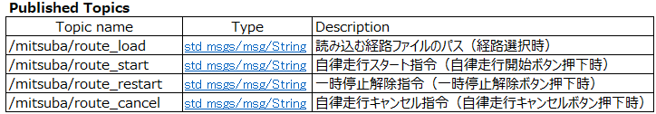

# ミツバ - 移動ロボット用ソフトウェア

## ミツバオリジナルパッケージ  mitsuba_gui

### ファイル構成

### ROS2ノードブロック図  
  図にROS2ノードブロック図を示す。黄色いブロックの1行目にパッケージ名、2行目にlaunchファイル名を示している。黄緑  
  色と水色のブロック中の1行目にROS2のパッケージ名、2行目にノード名を示している。矢印上のテキストの1行目にトピック  
  名、2行目にメッセージ型を示している。黄緑色のブロックは既存ソフト、水色のブロックはオリジナルソフトを示している。
  
  
### ノード仕様  
* param_set  
  param_setノードは各ノードのパラメータの取得、変更、パラメータファイルの保存を行う。事前に変更したいパラファイル(*.csv)を作成し、『paramsetting』フォルダに保存しておく。新しいパラメータリストファイルを作成した場合は  
  mitsuba_guiパッケージをビルドし直す必要がある。パラメータリストファイルの数だけ縦タブが作成される。パラメータリストファイルの書式は以下の通りである。  

  パラメータ名（自由）, パッケージ名, パッケージ名からのパラメータファイルのパス, ノード名, パラメータ変数名, 設定下限値 設定上限値  

  例えば、以下のように設定する。パラメータがintやdoubleの場合は設定下限値と設定上限値を設定しても良いし、設定  
  しなくても良い。パラメータがboolやstringの場合は設定しない方が良い。
  
    パラメータの取得にはオリジナルクラスのParameterGetter(parameter_getter.py)を用い、パラメータの設定にはオリジナルクラスのParameterSetter(parameter_setter.py)を用いる。
  
* sdf_param_set  
    sdf_param_setノードは、GUI操作により、ロボットのモデルファイルである『robot_model.sdf』のアップデートを行う。  
    アップデートを行うsdfファイルのパスはmitsuba_simパッケージ下の、『/sdf/models/robot_model.sdf』である。  
    LiDARの取付位置を設定する場合は、『Link Name』欄に『base_scan』と入力し、X座標、Y座標、Z座標、Roll、  
    Pitch、Yawを入力し、『SDF UPDATE』ボタンを押すことによりsdfファイルのアップデートを行うことができる。  
* map_save  
    SLAM地図を作成する場合、地図作成起動ボタンで、mitsuba_launchパッケージのcreate_map.launch.pyを起動する。  
    map_saveノードは手動走行を行いSLAM地図を作成した後に、SLAM地図名を入力し、保存ボタンを押すことにより、  
    SLAM地図を保存する。保存ボタンを押した際に、/slam_toolbox/save_mapにslam_toolbox/srv/SaveMapを  
    /slam_toolbox/serialize_mapにslam_toolbox/srv/SerializePoseGraphのサービスを発行する。  
  
* route_set  
    経路を作成する場合、経路を作成したいSLAM地図を選択し、経路作成起動ボタンを押すことにより、mitusba_launch  
    パッケージのroute_setting.launch.pyを起動する。  
    route_setノードはrviz2で指定したウェイポイント（/goal_poseトピックののポーズメッセージ  
    geometry_msgs/msg/PoseStamped）を受信し、経路ファイルを作成する。複数のウェイポイントを指定し、経路  
    を作成したら、ファイル名を指定し、保存ボタンを押すことにより、経路ファイルが保存される。Rviz2に指定したウェイポイント  
    を表示するために、/waypointsトピックにvisualization_msgs/msg/MarkerArrayを発行する。  
  
* autonom_run  
    自律走行を行う場合、SLAM地図を選択し、自律走行起動ボタンを押すことにより、mitsuba_launchパッケージの  
    auto_run_slamtoolbox.launch.pyを起動する。  
    autonom_runノードはnav2_simple_commanderパッケージのnav_throuph_poses_csvノードに対して、自律  
    走行の経路ファイルのパス、自律走行スタート指令、一時停止解除指令、自律走行キャンセル指令をパブリッシュする。メッ  
    セージの型は全てstd_msgs/msg/Stringだが、経路ファイルのパス以外は空Stringである。  

