# ミツバ - 移動ロボット用ソフトウェア

## ミツバオリジナルパッケージ  mitsuba_launch

### ファイル構成
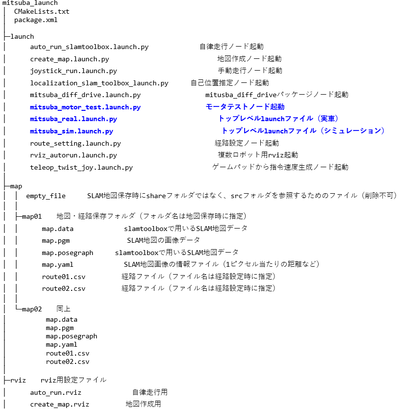
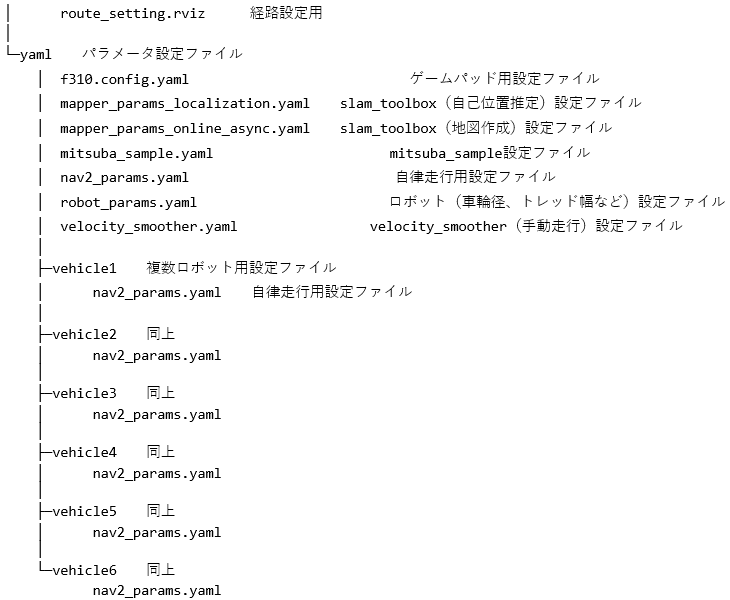
### パッケージ概要  
  mitsuba_launchパッケージは、各種ノード起動のためのlaunchファイル、SLAM地図と自律走行経路を保存するmap  
  フォルダ、rviz2の設定ファイルを保存するrvizフォルダ、各種ノードのパラメータ設定ファイルを保存するyamlフォルダからなる。  

### launchファイル  
  launchファイルはlaunchファイル中で呼ばれるlaunchファイルもあるので、たくさんあるが、手動で起動するlaunchファイル  
  は以下の3つである。  
        motor_test.launch.py ・・・　モータの駆動テストを行う場合
        mitsuba_real.launch.py ・・・　実ロボットで手動走行、SLAM地図作成、経路作成、自律走行を行う場合  
        mitsuba_sim.launch.py ・・・　シミュレーションで手動走行、SLAM地図作成、経路作成、自律走行を行う場合  
* motot_test.launch.py  
    motor_test_launch.pyはモータの駆動テストを行う場合に用いる。Launchファイルを起動した場合に起動されるノード  
    を以下に示す。  

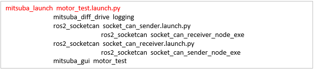
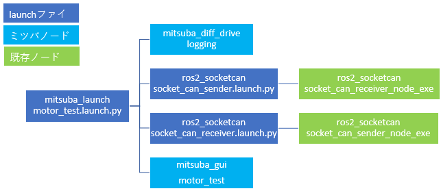  
    以下に、launchファイル、ノード、トピック、メッセージの関係を示したブロック図を示す。  
    ミツバ製ドライバとのCAN通信にはros2_socketcanパッケージを用いている。CAN通信で受信したデータを  
    mitsuba_diff_driveパッケージのloggingノードで変換し、mitsuba_guiパッケージのmotor_testノードで表示を  
    行っている。また、motor_testノードのGUI操作からモータの駆動指令が出せるようになっている。  
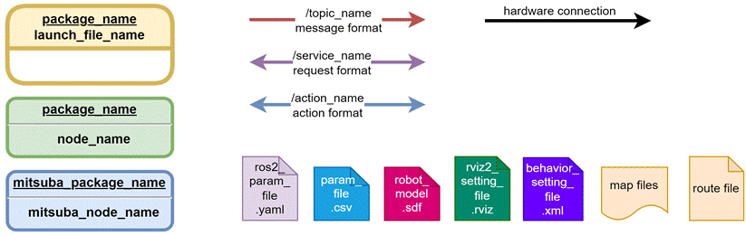  
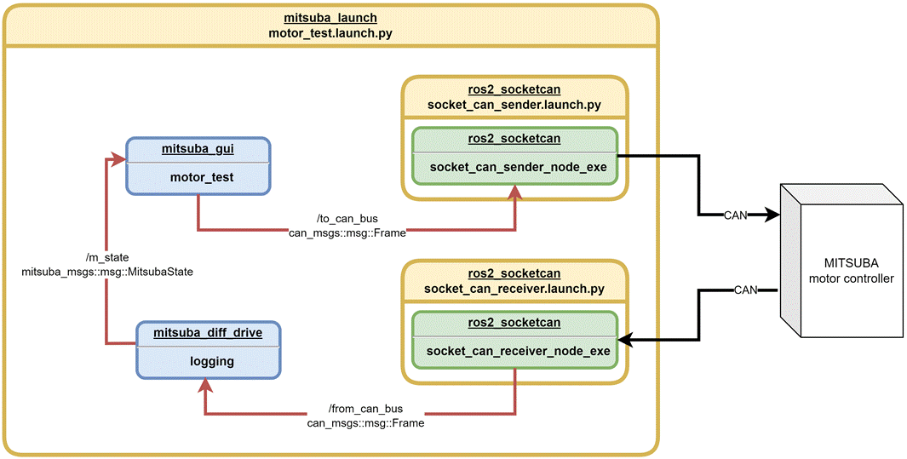  
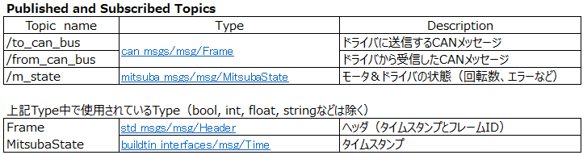  

* mitsuba_real.launch.py  
    mitsuba_real.launch.pyは実ロボットで手動走行、SLAM地図作成、経路作成、自律走行を行う場合に用いる。  
    Launchファイルを起動した場合に起動されるノードを以下に示す。  
    ロボットの手動走行を行うためのjoystick_run.launch.py、LiDARを起動するlaunchファイル、音声の発生のための  
    soundplay_nodeノード、ミツバGUIの起動を行う。  
    mitsuba_guiパッケージのmap_saveノード（地図作成タブ）では地図作成ボタンを押すことにより、  
    create_map.launch.pyが起動する。  
    route_setノード（経路生成タブ）では、作成したSLAM地図を選択して経路作成ボタンを押すことにより、  
    route_setting.launch.pyが起動する。  
    autonom_runノード（自律走行タブ）では、作成したSLAM地図を選択して自律走行起動ボタンを押すことにより、  
    auto_run_slamtoolbox.launch.pyが起動する。  
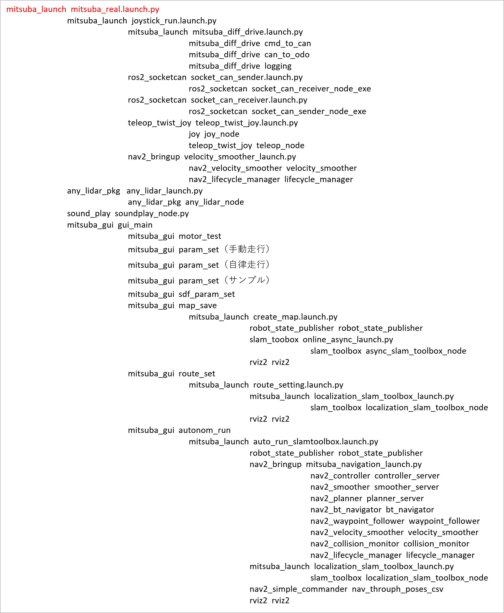  
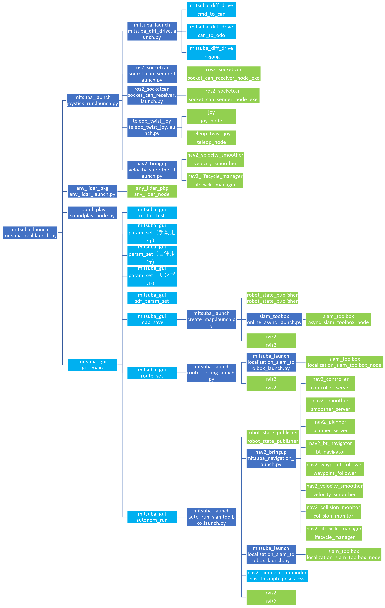  
    以下に、launchファイル、ノード、トピック、メッセージの関係を示したブロック図を示す。  
    mitsuba_diff_driveパッケージとmitsuba_guiパッケージに関するものの説明は省略する。  
    ゲームパッドの操作をjoyパッケージのjoy_nodeノードでROS2メッセージにし、teleop_twist_joyパッケージの  
    teleop_nodeで走行指令にしている。  
    走行指令はnav2_velocity_smootherパッケージのvelocity_smootherノードで最大速度や最大旋回速度、  
    最大加速度などを設定し、走行指令を滑らかにしている。  
    LiDARデータはLiDARメーカが提供しているパッケージを用いて、/scanトピックにsensor_msgs/msg/LaserScan型の  
    メッセージを配信する。その時のframe_idは『base_scan』とする。  
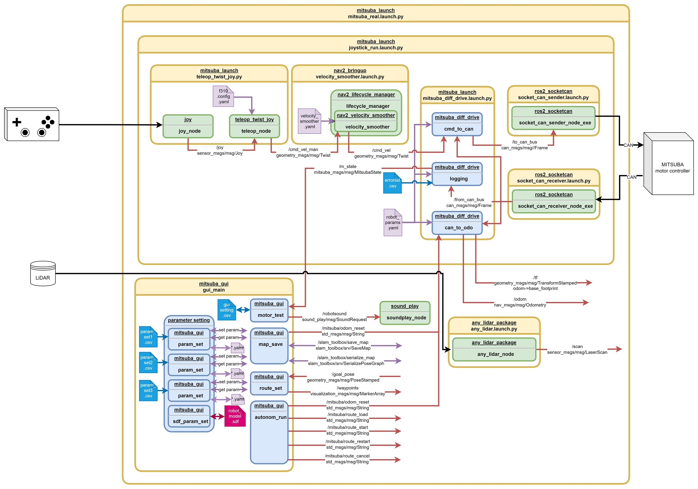  
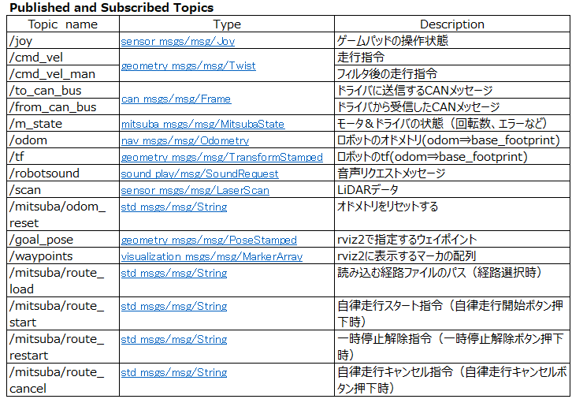  
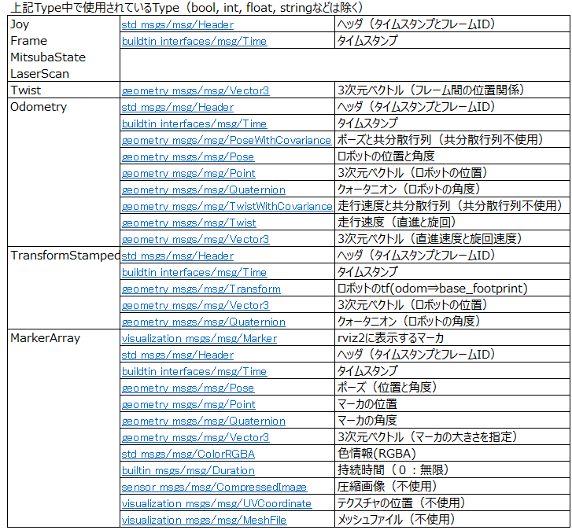  
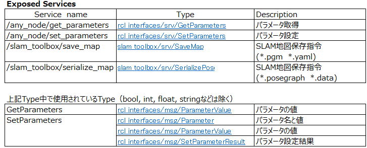  
    GUIの地図保存タブで、地図作成起動ボタンを押した際のブロック図を以下に示す。  
    地図作成起動ボタンを押すと、/mitsuba/odom_resetトピックに空Stringがパブリッシュされ、mitsuba_diff_driveパッ  
    ケージのcan_to_odoノードで計算しているオドメトリが、ゼロにリセットされる。（地図作成起動ボタンを押した時のロボットの  
    位置を原点とするため）  
    SLAM地図作成にはslam_toolboxパッケージを使用する。  
    [GitHub - SteveMacenski/slam_toolbox at humble](https://github.com/SteveMacenski/slam_toolbox/tree/humble)  
    slam_toolboxパッケージのasync_slam_toolbox_nodeノードに4つのトピック（/odom、/tf、/tf_static、/scan）を入力し  
    ながら、ロボットを走行させることによりSLAM地図が作成され、GUI操作により発行される2つのサービス  
    {/slam_toolbox/save_map、/slam_toolbox/serialize_map}によりSLAM地図を保存する。  
    /tf_staticトピックへは、robot_state_publisherパッケージのrobot_state_publisherノードをロボットのモデルファイル  
    『robot_mode.sdf』を読み込んで起動することにより、  
* base_footprintフレーム　⇒　base_linkフレーム  
* base_linkフレーム　⇒　base_scanフレーム  
* base_linkフレーム　⇒　base_cameraフレーム  
    のtfメッセージが配信される。  
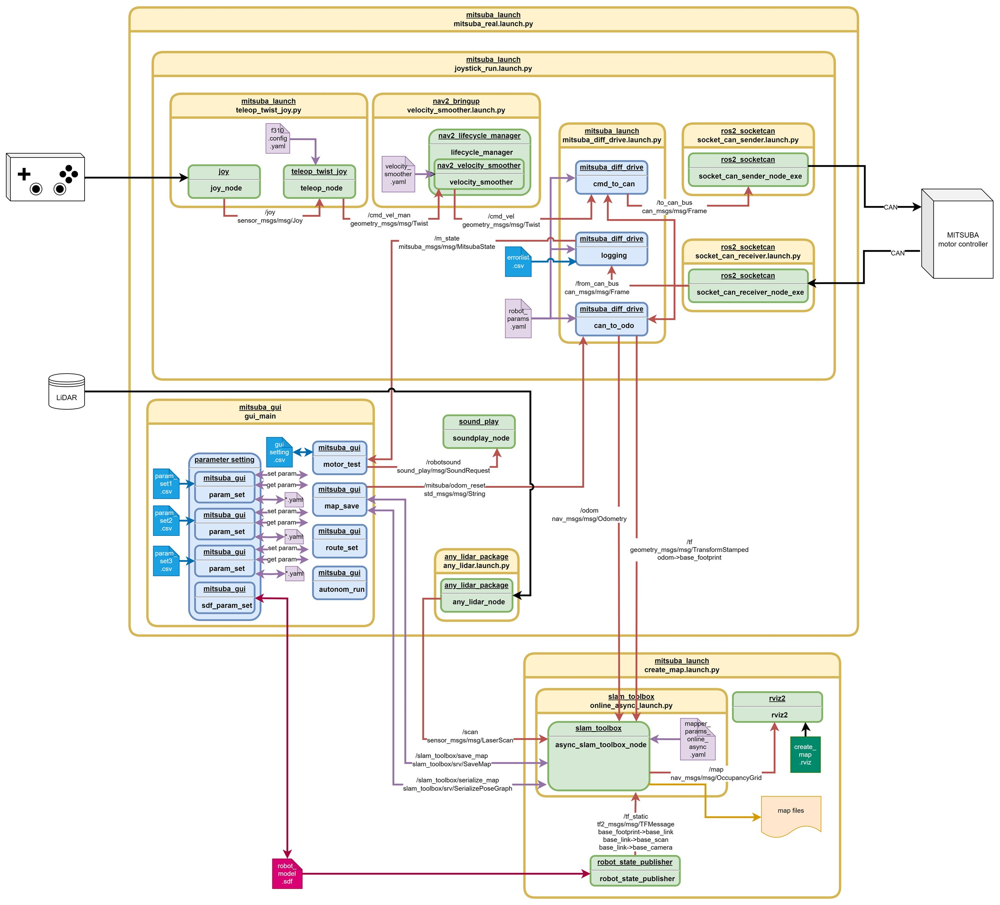  
    create_map.launch.pyを起動したことによって発生するトピックを以下に示す。  
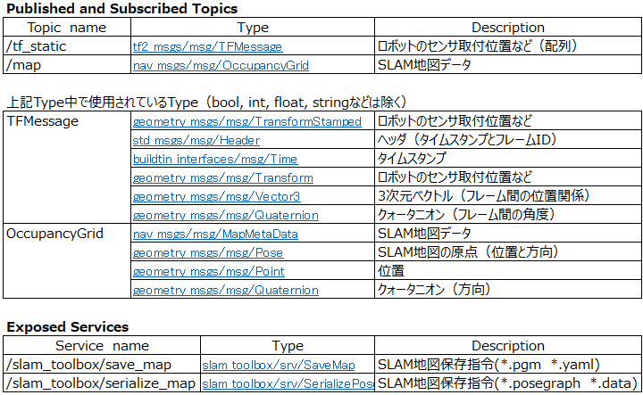  

    GUIの経路設定タブで、SLAM地図を選択し、経路作成起動ボタンを押した際のブロック図を以下に示す。  
    slam_toolboxパッケージのlocalization_slam_toolbox_nodeノードにSLAM地図ファイルを読み込ませることにより、/mapト  
    ピックに地図データをパブリッシュし、rviz2でSLAM地図を表示している。  
    rviz2のSLAM地図上の任意の地点をフリックすることにより、ウェイポイントを指定していく。  
    GUI上の経路名を指定し、経路保存ボタンを押すことにより、経路ファイルが作成される。  
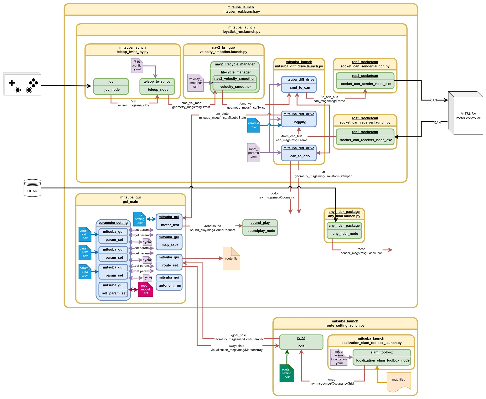  
    route_setting.launch.pyを起動したことによって発生するトピックを以下に示す。  
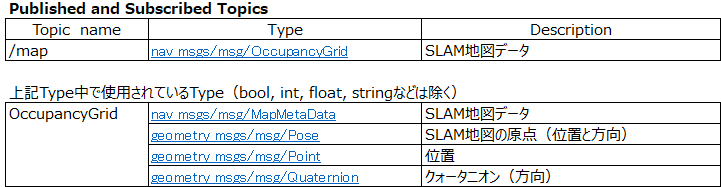  
    GUIの自律走行タブで、SLAM地図を選択し、自律走行起動ボタンを押した際のブロック図を以下に示す。  
    slam_toolboxパッケージのlocalization_slam_toolbox_nodeノードでSLAM地図を読み込み、4つのトピック（/odom、/tf、  
    /tf_static、/scan）を入力することにより、自己位置推定を行う。  
    SLAM地図作成時と同様に、/tf_staticトピックへは、robot_state_publisherパッケージのrobot_state_publisherノードを用いる。  
    SLAM地図作成時と自律走行スタート時の初期位置が異なる場合、rviz2で初期位置を指定する必要がある。  
    自己位置補正結果は/tfトピック（mapフレーム　⇒　odomフレーム）に配信される。  
    自律走行については、nav2_simple_commanderシートで説明する。  
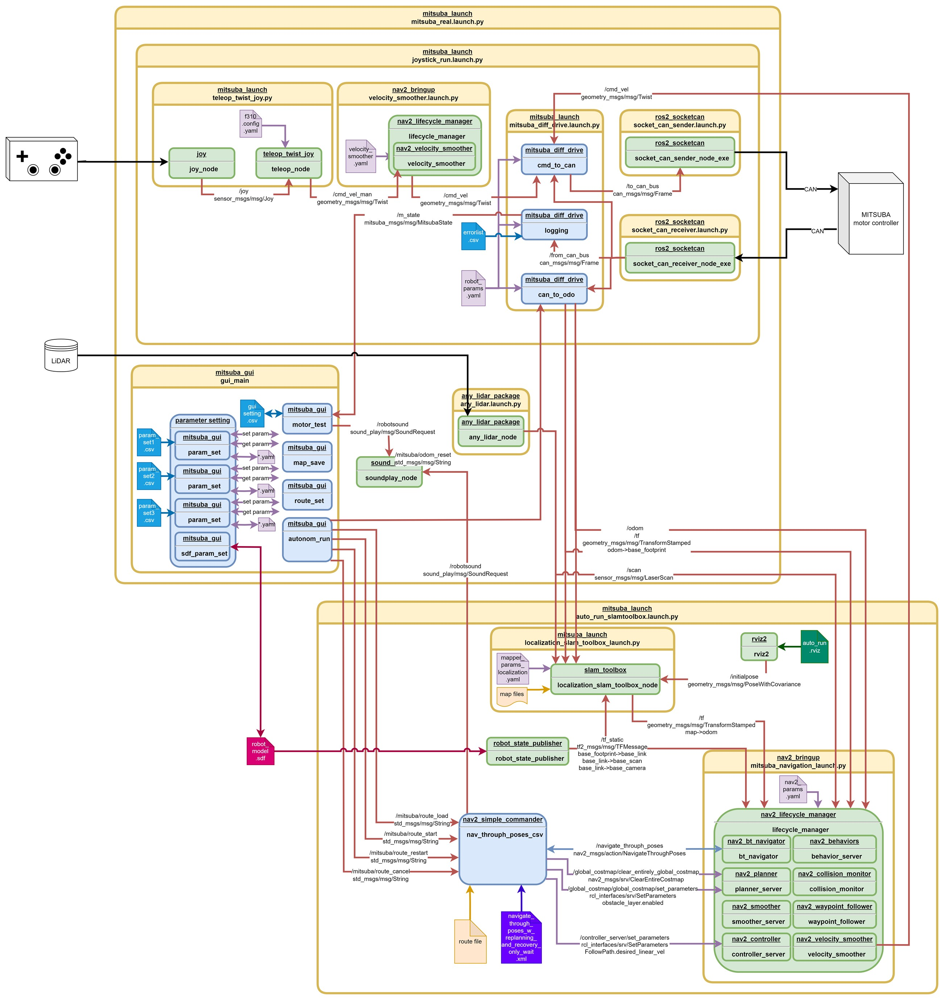  
    auto_run_slamtoolbox.launch.pyを起動したことによって発生したトピックを以下に示す。  
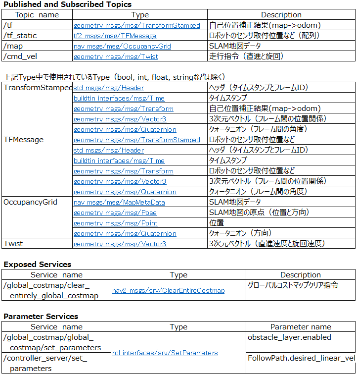
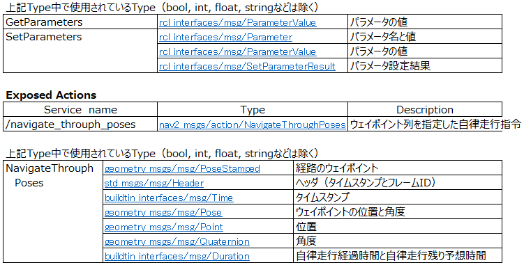

*  mitsuba_sim.launch.py  
    mitsuba_sim.launch.pyはシミュレーションで手動走行、SLAM地図作成、経路作成、自律走行を行う場合に用いる。  
    シミュレーションには、GAZEBOを使用する。  
    [Gazebo (gazebosim.org)](https://gazebosim.org/home)  
    Launchファイルを起動した場合に起動されるノードを以下に示す。  
    mitsuba_simパッケージのmitsuba_sim.launch.pyでシミュレーションワールドの起動、ロボットモデルのスポーン、GAZEBO  
    トピックとROS2トピックのブリッジ、手動走行のためのノードを立ち上げている。これについては、『mitsuba_sim』シートで説明し  
    ている。  
    音声の発生のためのsoundplay_nodeノードとミツバGUIの起動はmitsuba_real.launch.pyと同様である。
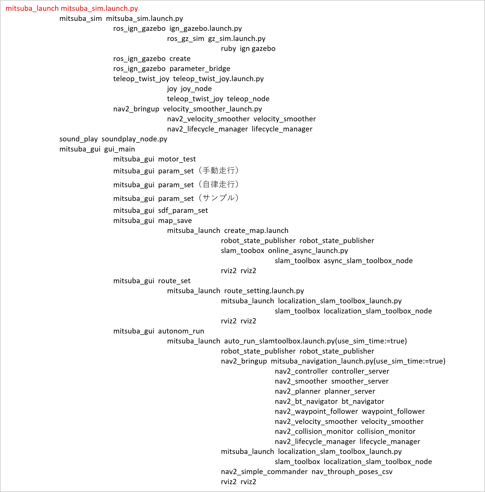  
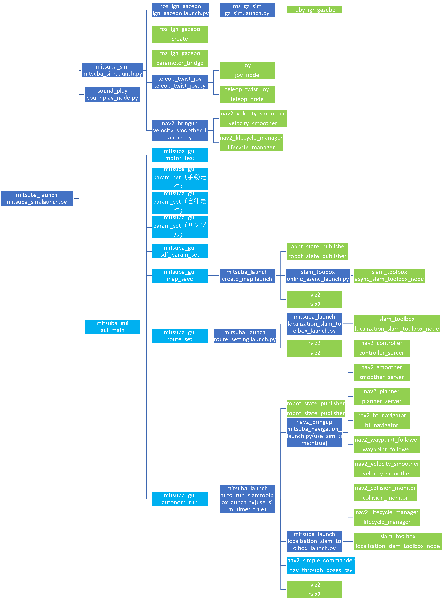  
    以下に、launchファイル、ノード、トピック、メッセージの関係を示したブロック図を示す。  
    mitsuba_real.launch.pyとの違いは、mitsuba_simパッケージのmitsuba_sim.launch.pyの部分であるが、説明は  
    『mitsuba_sim』シートを参照ください。
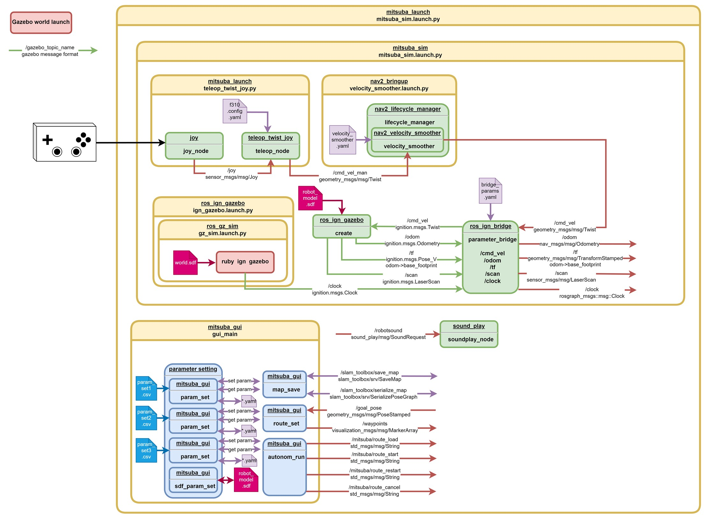  
    実機とシミュレーションの違いは、5つのトピック(/cmd_vel、/odom、/tf(odom->base_footprint)、/scan、/clock)で  
    ある。  
    実機では、ロボットが走行指令(/cmd_vel)を受け取り、モータが回転し、ドライバからのホールセンサパルス数からオドメトリを  
    計算し、/odomトピックと/tfトピックにパブリッシュしていた。また、LiDARから/scanトピックにLiDARデータをパブリッシュしていた。  
    シミュレーションでは、シミュレーションモデルからパブリッシュされる/odom、/tf(odom->base_footprint)、/scanトピックへ  
    のGAZEBOメッセージをparameter_bridgeノードでROS2メッセージに変換し、/cmd_velトピックのROS2メッセージを  
    GAZEBOメッセージに変換し、シミュレーションモデルに入力する。また、GAZEBOの時刻とROS2の時刻を合わせるため、  
    /clockトピックのGAZEBOメッセージもROS2メッセージに変換する。以下にトピックおよびメッセージ型の変換表を示す。  
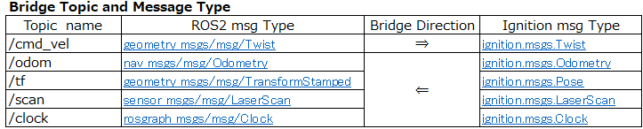  
    GUIの地図保存タブで、地図作成起動ボタンを押した際のブロック図を以下に示す。  
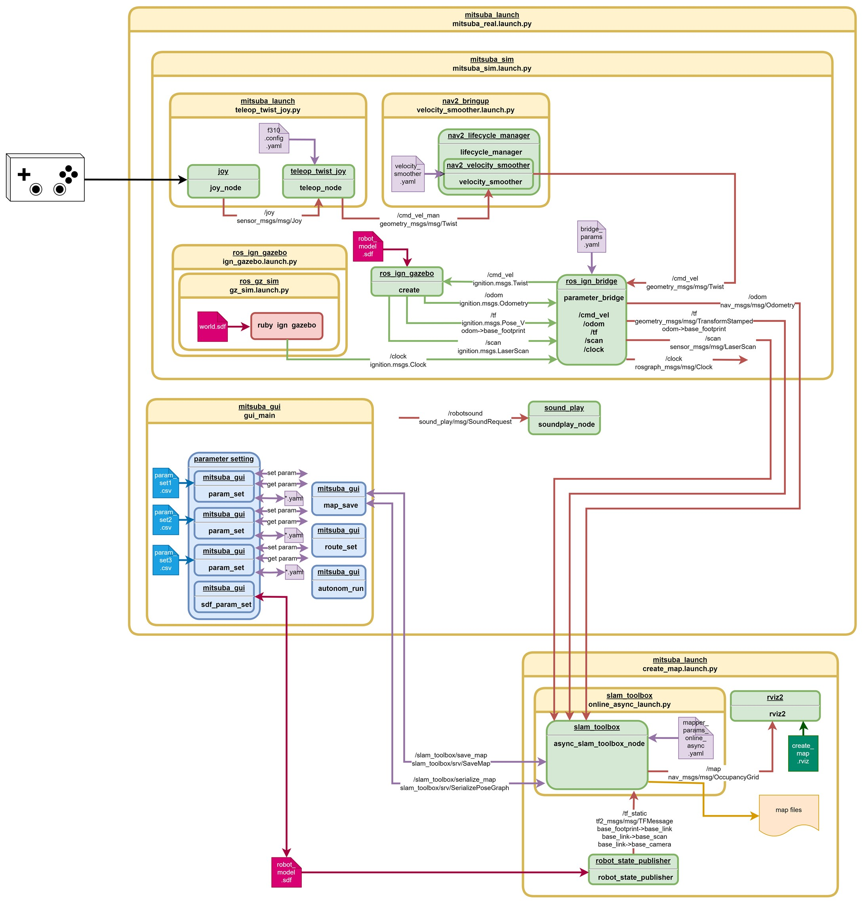  
    GUIの経路設定タブで、SLAM地図を選択し、経路作成起動ボタンを押した際のブロック図を以下に示す。  
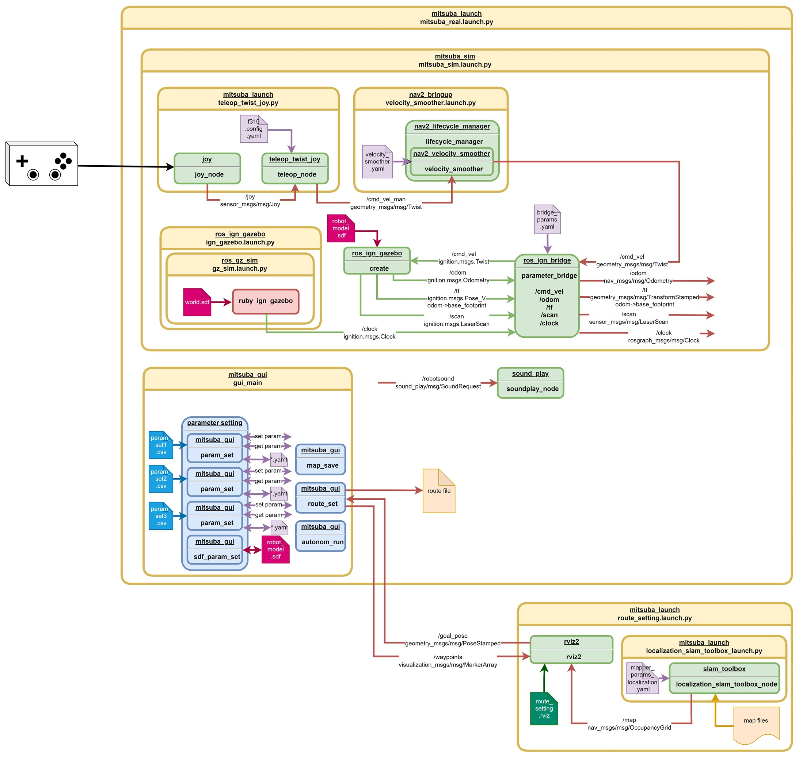  
    GUIの自律走行タブで、SLAM地図を選択し、自律走行起動ボタンを押した際のブロック図を以下に示す。  
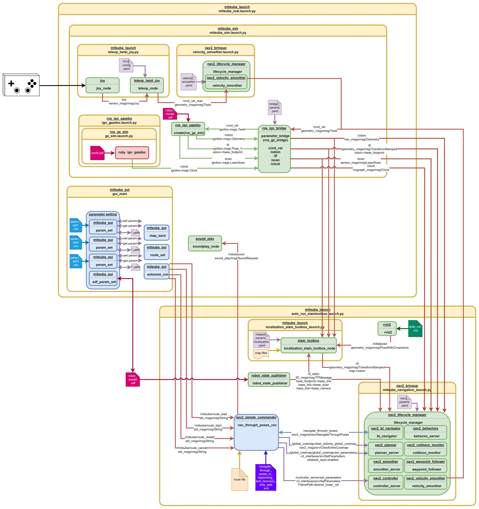  

