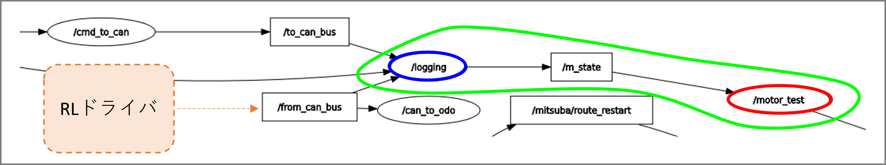
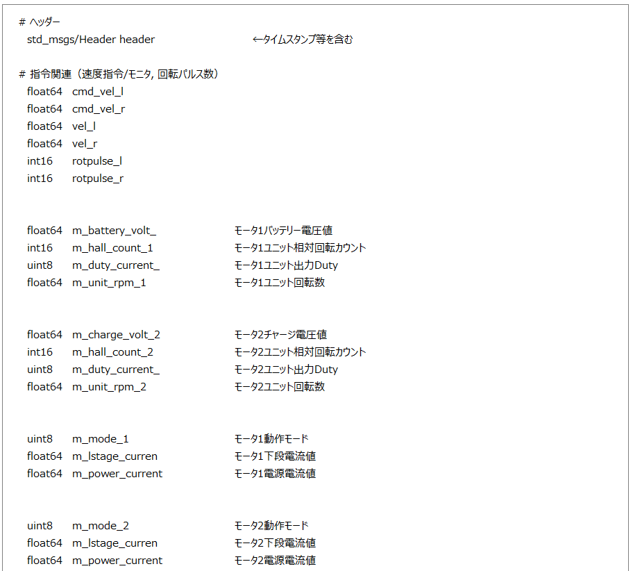
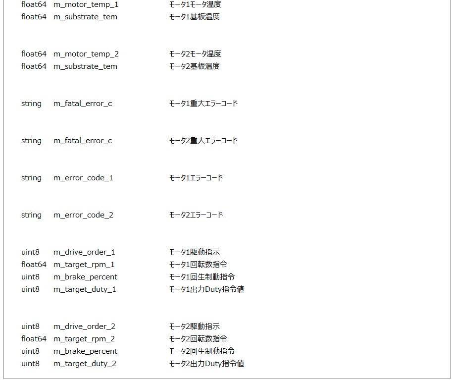

# ミツバ - 移動ロボット用ソフトウェア

## ミツバオリジナルパッケージ  mitsuba_msgs

### mitsuba_msgs  
    タブ「モータテスト」のモータ動作情報欄で各種モニタ値を表示するため、RLドライバから該当のCANメッセージを取得する必要がある。  
    モータテストタブで表示する対象のパラメータ類を ROSメッセージ「mitsuba_msgs/msg/MitsubaState」として定義する。データの取得方法について、  
    ノード「logging」内からmitsuba_msgs/msg/MitsubaStateを/m_stateトピックにパブリッシュし、モータテストタブ側でサブスクライブする方法とする。  
  
    メッセージ「mitsuba_msgs/msg/MitsubaState」の内容を以下に示す。  
  

