# ミツバ - 移動ロボット用ソフトウェア

## ミツバオリジナルパッケージ  mitsuba_sample

### 1. 目的  
ROS2を用いて新しい機能のノードを作成するための、サンプルノードを作成した。  
### 2. 目標  
下記のような仕様とする。  
受信メッセージ  
* ゲームパッド入力  
* LiDARデータ  
* ポイントクラウドデータ  
* 速度指令  
* 座標変換データ  
* CAN通信データ  
* オドメトリデータ  
タイマーコールバック  
* 50ms  
* 200ms  
送信メッセージ  
* 走行指令  
パラメータ設定機能付き  
### 3. mitusba_sampleパッケージフォルダ構成  
パッケージ名は仮にmitsuba_sampleとした。  
Cmakelists.txtによりsrcフォルダのsample_node.cppがビルドされる。4つのフォルダ[launch, rviz, sdf, yaml]がshareフォ  
ルダにコピーされる。  
launchフォルダのmitsuba_sample.launch.pyはyamlフォルダのmitsuba_sample.yamlで設定されたパラメータを用いて、  
sample_nodeを起動する。同時に、sdfフォルダのmitsuba_sample.sdfの設定でrobot_state_publisherを立ち上げ、  
/tf_staticをパブリッシュする。さらに、rvizフォルダのmitsuba_sample.rvizの設定を用いてrviz2を立ち上げる。  
  
### 3.1 sample_node  
動作確認についてはUbuntu22.04(Humble、amd64)、Ubuntu20.04(Galactic、arm64)で行ったが、他の組み合わせで  
も動作すると思われる。  
sample_nodeの受信メッセージおよび送信メッセージを図1に示す。  
これに加えて、50msと200msのタイマーコールバックを設定してある。  
受信メッセージを絞りたい場合は、プログラム中のサブスクライバーの作成をコメントアウトすると良い。  
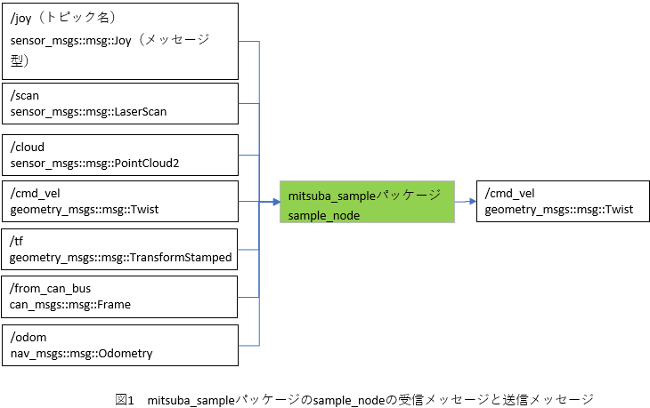  
    メッセージ型を以下に示す。  
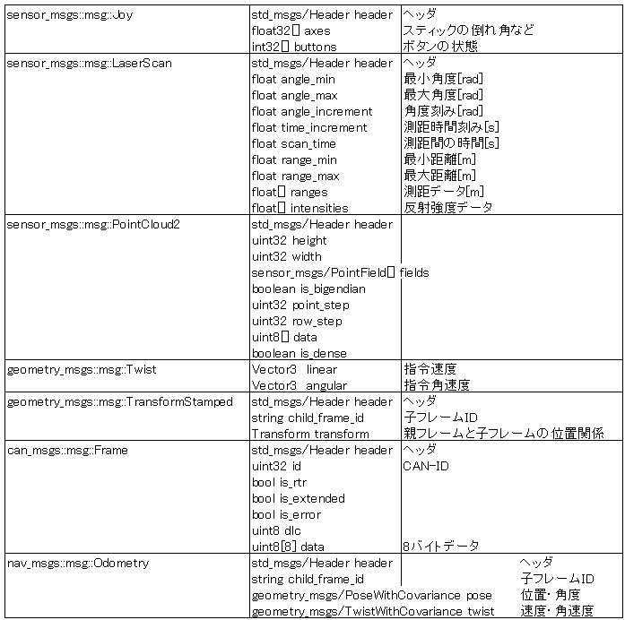  
### 4. ファイル解説  
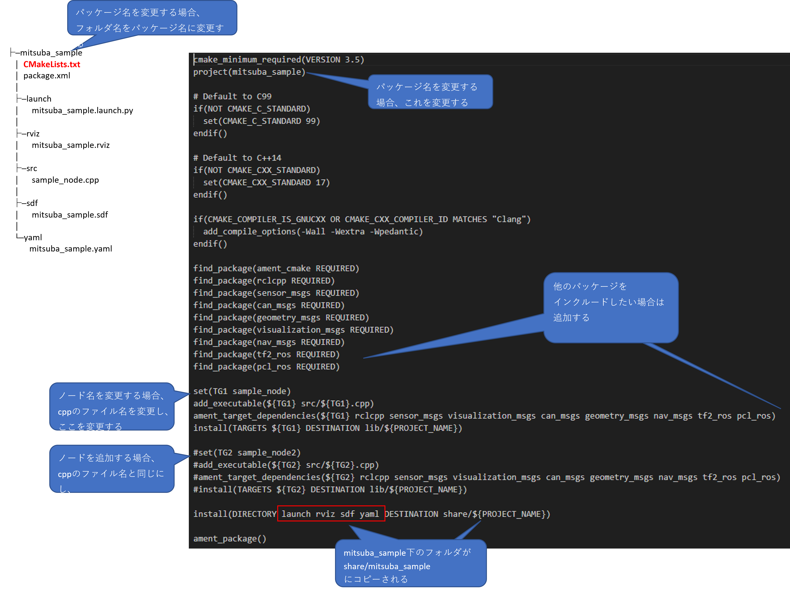  
  
  
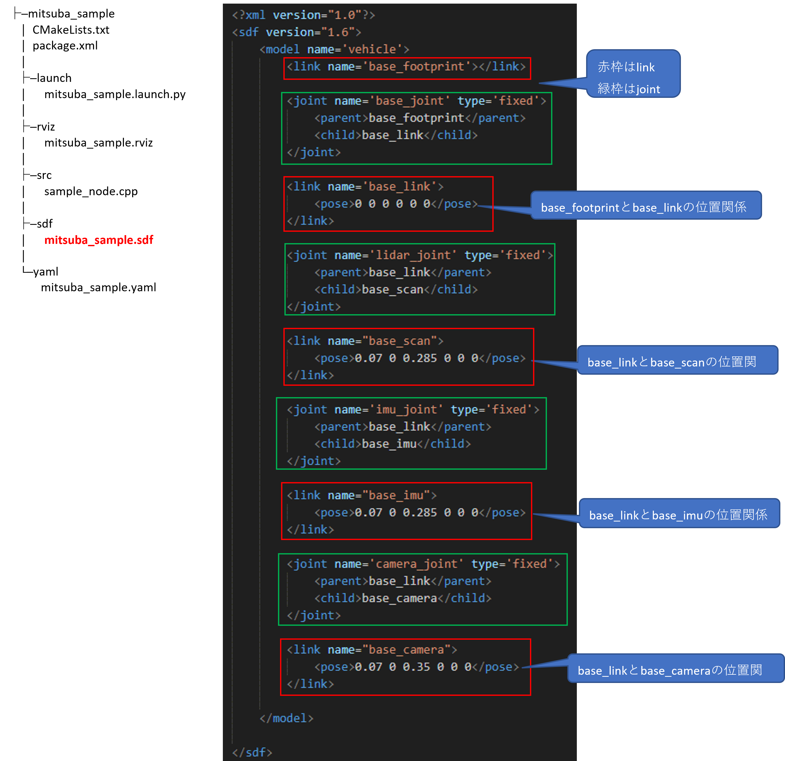  
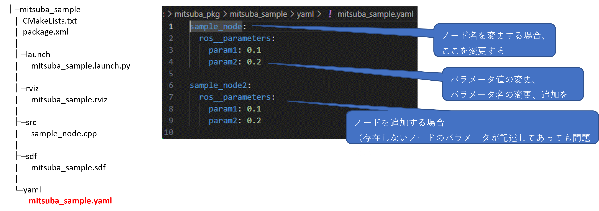  
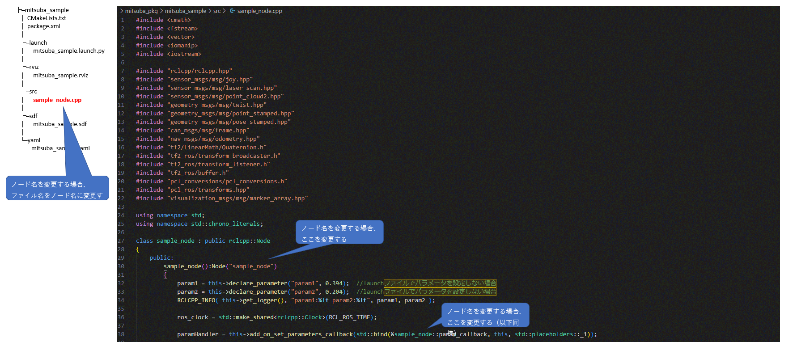
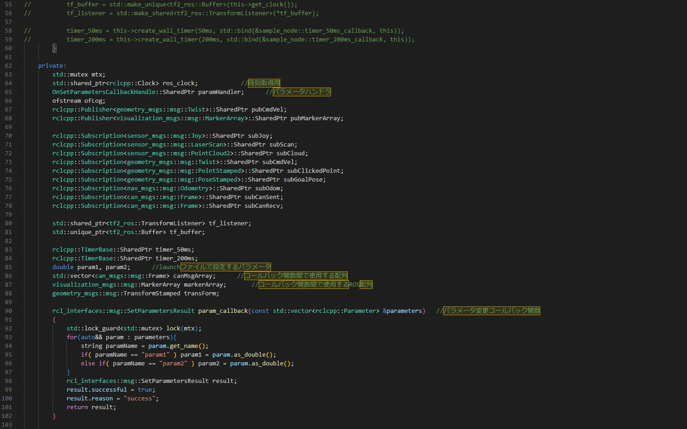  
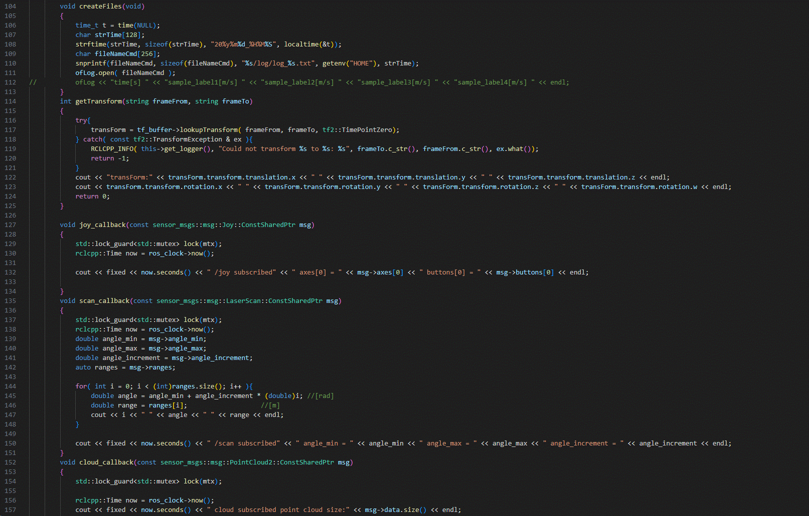  
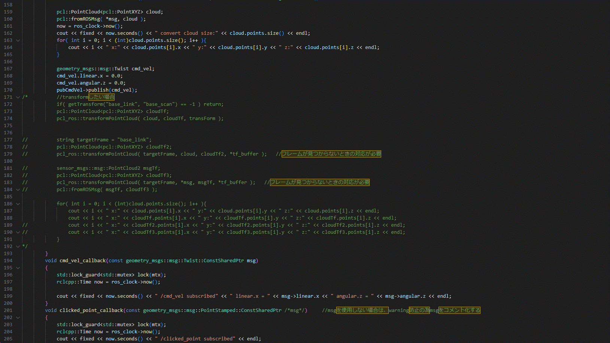
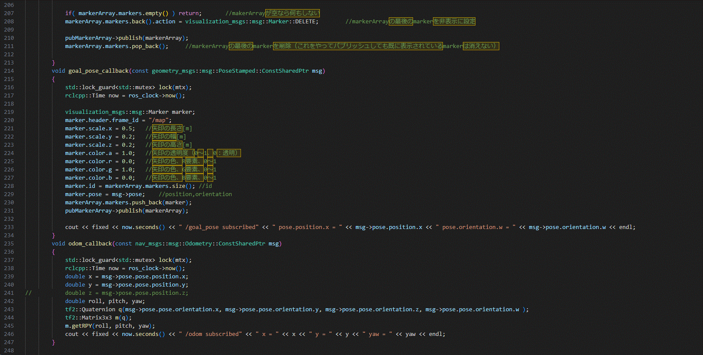
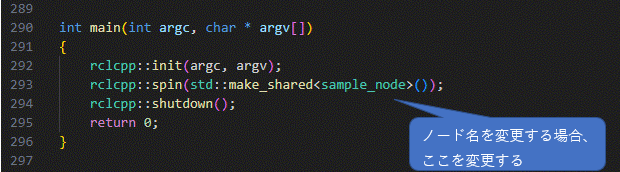

