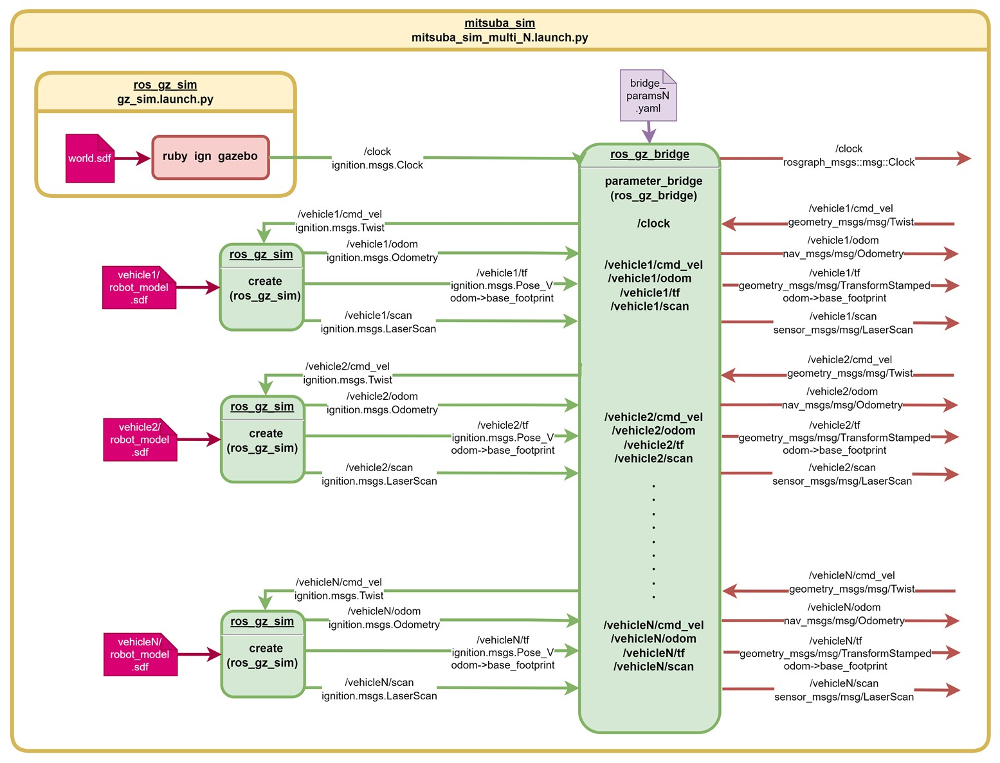

# ミツバ - 移動ロボット用ソフトウェア

## ミツバオリジナルパッケージ  mitsuba_sim

### ファイル構成


### ROS2ノードブロック図  
以下にROS2ノードブロック図を示す。黄色いブロックの1行目にパッケージ名、2行目にlaunchファイル名を示している。黄緑  
色のブロック中の1行目に既存のROS2のパッケージ名、2行目にノード名を示している。矢印上のテキストの1行目にトピック  
名、2行目にメッセージ型を示している。赤色のブロックはGazeboワールドの起動を示している。  
  

* mitsuba_sim.launch.pyを起動した場合（ロボット1台でのシミュレーション環境）  
  
* mitsuba_sim_multi_N.launch.pyを起動した場合（複数台のロボットでのシミュレーション環境）  
以下に、複数台のロボットでのシミュレーション環境のブロック図を示す。LaunchファイルはN=1~6まで用意してある。  
GAZEBOワールドの起動は、1台のロボットでのシミュレーション時と同様であり、ロボットのスポーンにはvehicle1～vehicle6の  
フォルダ中のrobot_model.sdfを用いる。  
また、GAZEBOトピックとROS2トピックのブリッジのためのパラメータファイルもbridge_param1.yaml~bridge_param6.yaml  
を用いるようになっている。  
  
* mitsuba_sim_multi_N.launch.pyとmitsuba_guiパッケージのautonom_runノードを起動した場合（複数台のロボットで自律走行を行う場合）  
複数台ロボットのシミュレーション環境を立ち上げて、mitsuba_guiパッケージのautorun_runノードを複数起動すること  
により、複数台ロボットの自律走行シミュレーションを行うことができる。  
autonom_runノードを起動するときに、以下のように引数に『multi_sim』を設定し、さらに、namespaceを指定する必要が  
ある。（Nは自律走行させたいロボットの番号）  
```bash
$  ros2  run  mitsuba_gui  autonom_run  multi_sim  --ros-args  --remap  __ns:=/vehicleN  
```
このように起動することにより、GUI操作でSLAM地図を選択し、自律走行起動ボタンを押した時に起動する  
autorun_slamtoolbox.launch.pyで読み込まれるモデルファイルと自律走行用のパラメータファイルが、  
『mitsuba_simパッケージフォルダ』/sdf/models/vehicleN/robot_model.sdf  
『mitsuba_launchパッケージフォルダ』/yaml/vehicleN/nav2_params.yaml  
になる。（複数のロボットで、異なるモデルと異なる自律走行パラメータでシミュレーションすることができる）  
ただし、1台のPCで複数台ロボットのシミュレーションを行う場合、ロボットの台数を増やすほどRTF（リアルタイムファク  
ター）の値が下がり、自己位置補正が怪しくなる現象を確認した。  
例えば、第8世代Intel Core i7のPCでは3台のロボットでの自律走行シミュレーション実行時にRTFは80%程度とな  
り、6台のロボットでの自律走行シミュレーションではRTFは7%程度となった。  
6台のロボットでの自律走行シミュレーションを行う場合は、2台のPCをネットワークで接続し、1台のPCでGAZEBOを起  
動し、もう1台のPCで自律走行プログラムを起動することにより、6台の自律走行シミュレーション時のRTFが85％程度と  
なることを確認した。  
以下に、N台分のロボットのシミュレーションモデルと1台分の自律走行プログラムを立ち上げた場合のブロック図を示す。  
それぞれのトピックがnamespaceに対応しており、/vehicle1というnamespaceとしている。  
N台分の自律走行プログラムを立ち上げた際も、同様の接続となる。  
robot_model.sdfとnav2_params.yamlはロボット毎に変更できるようにしているが、自己位置補正用のパラメータ  
ファイル『mapper_params_localization.yaml』とビヘイビアツリー設定ファイル  
『navigate_throuph_poses_w_replanning_and_recovery_only_wait.xml』はnamespaceに依らず、同  
 一のファイルを使用している。  
  


