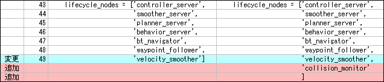
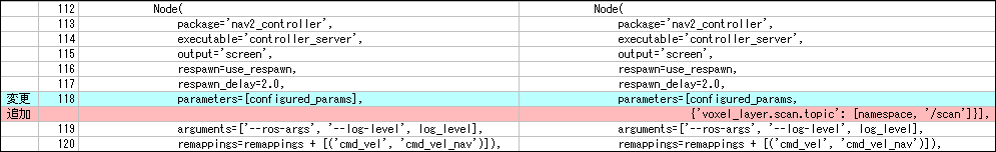
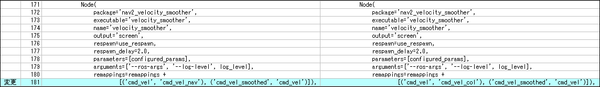
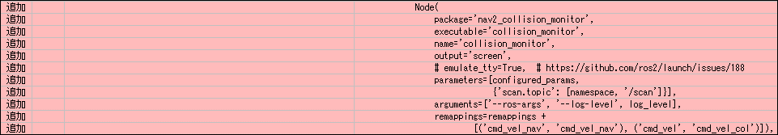
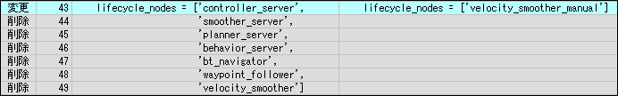
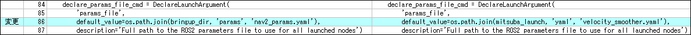
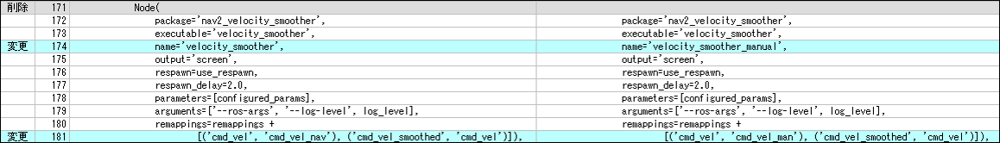
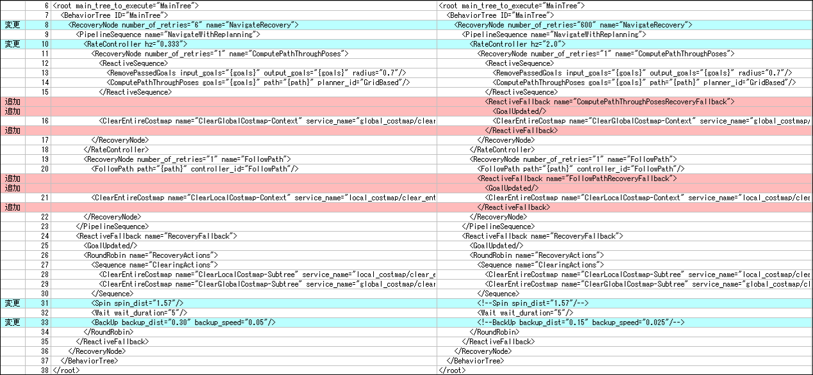
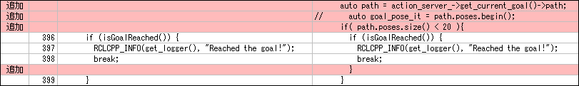
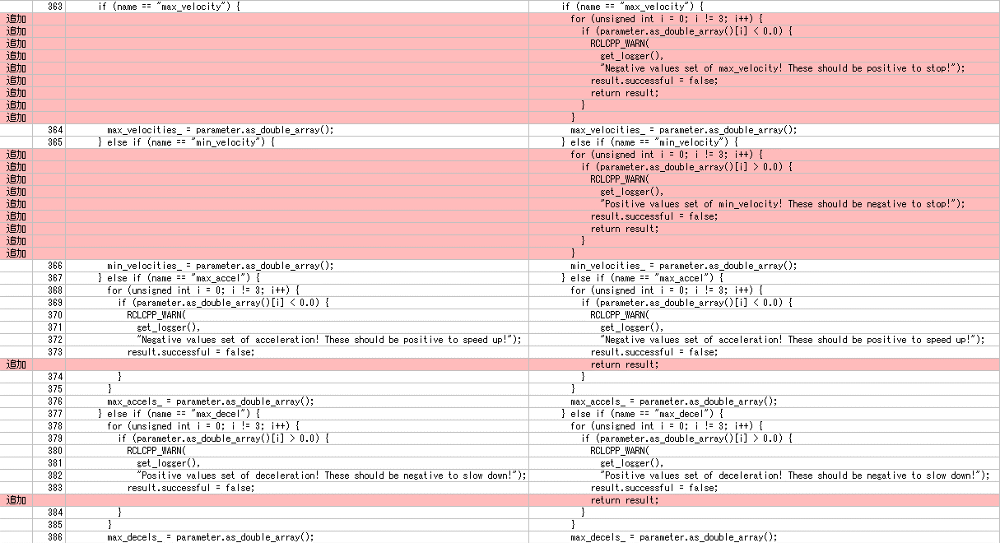

# ミツバ - 移動ロボット用ソフトウェア

## 依存ライブラリの修正

### navigation2  
navigation2のソースコードをgithubよりダウンロードし、修正を行い利用している。  
Humbleブランチ（バージョン1.1.9）をダウンロードし利用しているが、2024年2月14日現在のHumbleブランチのバー  
ジョンは1.1.13となっている。（各パッケージのpackage.xmlにて確認できる）  
[GitHub - ros-planning/navigation2 at humble](https://github.com/ros-planning/navigation2/tree/humble)   
### nav2_bringup  
①launchフォルダのnavigation_launch.pyを修正し、mitsuba_navigation_launch.pyを作成した。  
* lifecycle_nodeにcollision_monitorを追加。  

  
* controller_serverのパラメータ『voxel_layer.scan.topic』をnamespaceに対応。  
  
* velocity_smootherのトピックのリマップを変更。（Collision_monitorを追加したため）  
  
* collision_monitorの起動を追加。  
  
②launchフォルダのnavigation_launch.pyを修正し、手動操縦用のvelocity_smootherを起動する  
launchファイルvelocity_smoother_launch.pyを作成した。  
* lifecycle_nodeをvelocity_smootherのみに変更。  
  
* 読み込むパラメータファイルを変更。  
  
* velocity_smootherのnameを変更（自律走行用のvelocity_smootherも起動するため）  
トピックのリマップを手動走行用に変更。  
  
### nav2_bt_navigator  
behavior_treeフォルダのnavigate_through_poses_w_replanning_and_recovery.xmlを修正し、  
navigate_through_poses_w_replanning_and_recovery_only_wait.xmlを作成した。  
* number_of_retriesを6⇒600に変更（障害物を避けない設定で自律走行をしている時に、すぐに諦めないように）  
* RateController hzを0.333[hz]⇒2.0[hz]に変更（走行スピードを速くした場合に、経路の更新が遅かったため）  
* SpinとBackUpをコメントとし、リカバリ時に停止のみ行うようにした。  
  
### nav2_controller  
controller_server.cppを修正した。  
自律走行をスタートする時に、現在の座標とゴールの座標が近かった場合に、設定した経路を走行せずにゴールと  
判断してしまうため、計算されたパス（座標の羅列）のサイズが20未満の場合のみゴール判定を行うように変更した。  
20としたのは、座標間の距離が数cmであったため、ゴールまでの距離が1m程度となった場合のみゴール判定するよう  
にしたためである。  
  
### nav2_simple_commander  
example_nav_throuph_poses.pyを参考に、nav_throuph_poses_csv.pyを作成した。  
経路ファイル（csvファイル）を読み込み、経路ファイル通りに走行させるためのノードである。  
### nav2_velocity_smoother  
nav2_velocity_smootherは入力された走行指令を滑らかにする機能があるが、不正なパラメータを設定するとロボットが  
暴走する問題が発生した。  
最大速度や最大加速度に負の値を設定したり、最小速度や最小加速度に正の値を設定すると、指令速度が０に戻ら  
なくなる。  
不正なパラメータに設定できないよう、以下の修正を行った。  
なお、Humbleの次のバージョンであるIronでは対策済みであるため、ソースコードをダウンロードして修正する必要は無い。  
  

