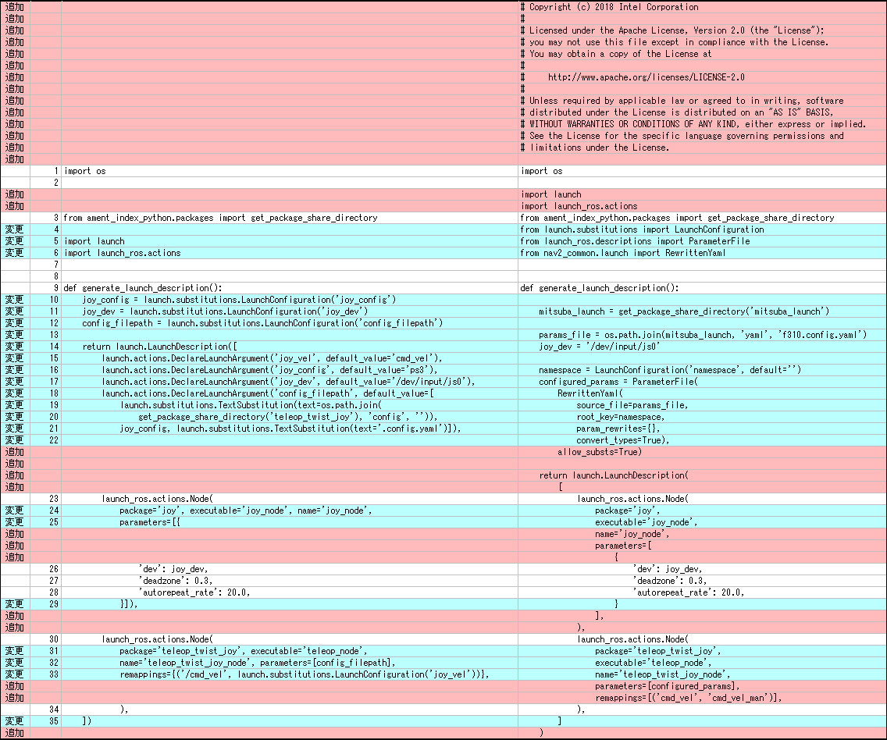

# ミツバ - 移動ロボット用ソフトウェア

## 依存ライブラリの修正

### teleop_twist_joy  
[GitHub - ros2/teleop_twist_joy at humble](https://github.com/ros2/teleop_twist_joy/tree/humble)  
ROS2インストールフォルダのteleop_twist_joyパッケージのlaunchフォルダのteleop-launch.pyを参考に、  
teleop_twist_joy.launch.pyを作成した。  
* namespaceに対応するため、『from nav2_common.launch import RewrittenYaml』を利用している。  
* RewrittenYamlを利用しているため、ライセンスを追加。  
* ジョイスティックデバイス、パラメータファイル、トピックのリマップを直打ちに変更。  

