# ミツバ - 移動ロボット用ソフトウェア

## 11. こんなときどうするFAQ  
### 手動走行ができない場合  
エラー状態の原因例  
    * モータが通電していない  
    * 重い処理を行うノードをメインスレッドで実行している  
    重い処理のノードをメインスレッドで実行すると、他のコールバック処理(サブスクライバ  
    のメッセージ受信、サービスのリクエスト処理など)がブロックされ、遅延が発生する可能性があります。  
    遅延が発生するとモータドライバへの信号が遅れ、エラー状態となることがあります。  
    重い処理があるノードはrclcpp::executors::MultiThreadedExecutorやthreading.threadなど別スレッド  
    で動かすとよいです。  
* 制御モードを確認してください。  
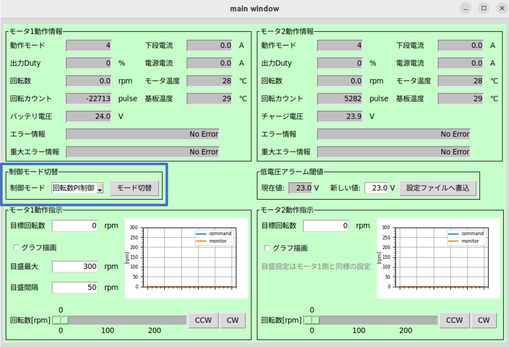  
制御モードが回転数PI制御の状態でモード切替ボタンを押してください。  

* 自律走行ができない場合  
    * 手動走行ができるか確認してください。  
        手動走行ができない場合は手動走行ができない場合を参照してください。  

    * LiDARに付着物や配線、ロボットや車両の一部が映りこんでいないか確認してください。  
        付着物や配線、ロボットや車両の一部が映りこんでいると障害物と認識し、障害物に接触した判定になり自律走行できません。  

    * Navigation2のCollision Monitor機能を使用している場合、停止エリアに障害物がないことを確認してください。  
        停止エリアに障害物があると停止エリアから障害物が無くならない限り、ロボットは停止します。  
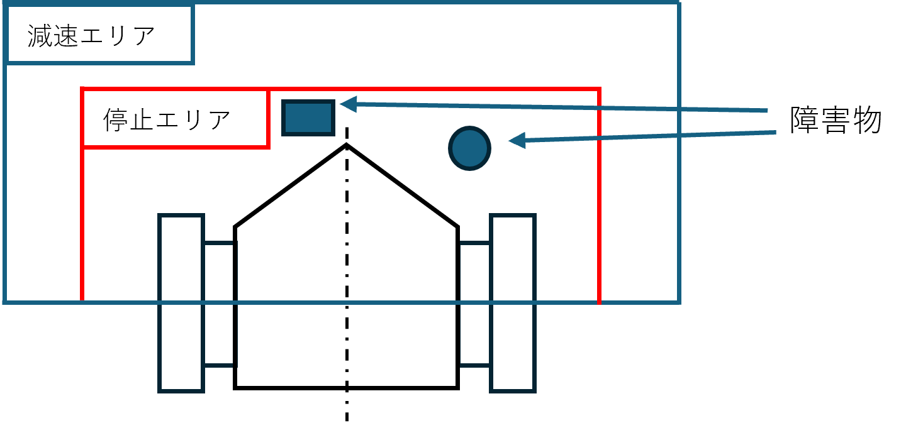  
    * 自律走行プログラムが起動していない状態でSystem Monitor等でROS2関連のプロセスが起動していないか確認してください。  
        起動している場合は、ROS2関連プロセスを終了し自律走行プログラムを起動してください。(PC再起動でもプロセスは終了できます)  
        ROS2関連のプロセスが起動している状態で、新たに自律走行プログラムを起動すると同じノードが複数立ち上がることになるため、データが二重、三重に送受信され誤作動を起こしている可能性があります。  
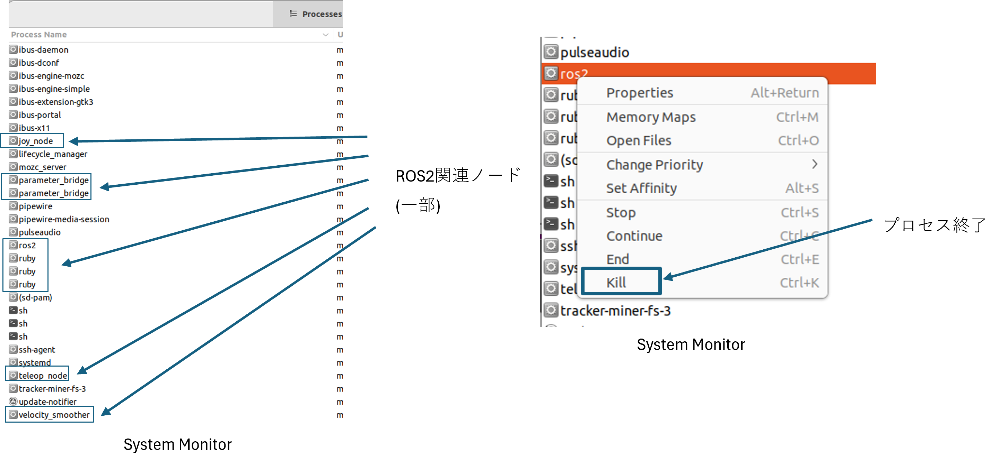  
    * 自律走行中に蛇行や自己位置ロストする場合  
        車両パラメータが正しく設定されているか確認ください。  
        車輪径、トレッド幅、減速比の値が違うとオドメトリが正しく計算されません。
        ### オドメトリの確認方法  
            1./odomトピックを配信するノードを起動する(joystick_runなど)
        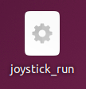  
            2.rviz2を起動  
          
            3.rviz2の画面でaddから/odomを追加  
               frameをodomに設定してください。  
        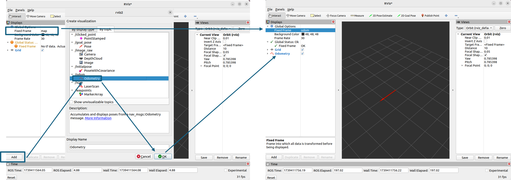  
            4.車両を一回転させ、オドメトリが同期していることを確認してください。  
            オドメトリが同期していない場合、車輪径、トレッド幅、減速比が間違っている可能性があります。
        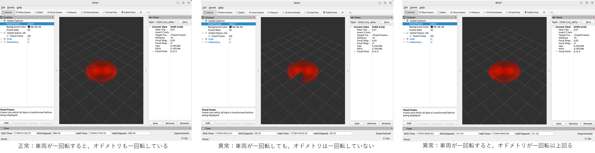  
    * 複数の方法を試しても自律走行できない場合  
    現状のcolcon_wsを削除し、Githubからcolcon_wsをダウンロードしビルドしてください。  
    * 経路ファイル(csv)を使用せずにゴールを設定したい場合  
        1.Rviz2上の「2D Pose Estimate」をクリックし、初期位置を設定します。
        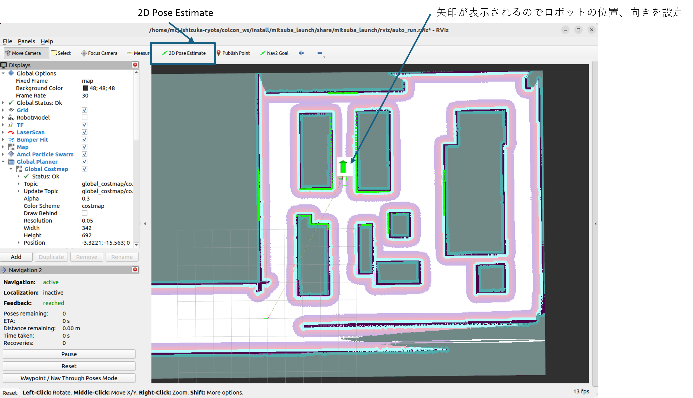
        ※ロボットが地図作成開始時の位置にいる場合は初期位置設定は行わなくても構いません。  
        2.「Nav2 Goal」をクリックし、Rviz2上にゴールを設定します。  
        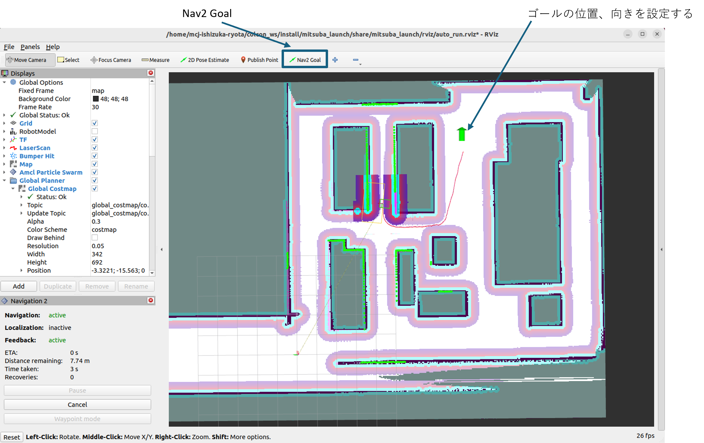
    * ゴールまでの距離を取得したい時  
        ゴールまでの距離はnav2_simple_commanderのFeedback機能を使用することで取得できます。  
        サンプルコードsrc>mitusba_pkg>nav2_humble>nav2_simple_commander>nav2_simple_commander>nav_throuph_poses_csv.py  
        Feedback機能を使用するにはnav2_simple_commanderをインポートする必要があります。  
          
    * 経路ファイル(csv)をオリジナルプログラムで使用したい時  
        src>mitusba_pkg>nav2_humble>nav2_simple_commander>nav2_simple_commander>nav_throuph_poses_csv.py  
        のdef route_load_callback(self, msg)関数は経路ファイルから座標情報を抽出している。  
        抽出した座標をgoThrouphPoses()やgoToPose()に渡すことで、経路を指定できる。  
    * 障害物に経路を阻まれた場合にバックし、経路を再計画したい時  
        デフォルトの設定では経路が障害物に阻まれた場合、障害物が除去されるまでロボットは待機し続けます。  
        この行動はxml形式で書かれています。  
        バックしたい場合はsrc>mitusba_pkg>nav2_humble>nav2_simple_commander>nav2_simple_commander>nav_throuph_poses_csv.py  
        のxmlファイルを変更します。  
        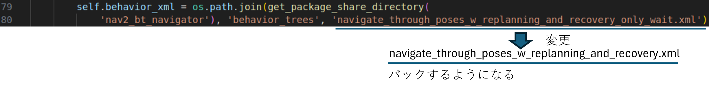   
        オリジナルのxmlファイルも使用可能です。  
        サンプルコードはsrc>nav2_humble>nav2_bt_navigator>behavior_treesにあります。  
    * basic_navigatorノードが複数立ち上がり、自律走行ができない時  
        colcon_wsを削除し、Githubからcolcon_wsをダウンロードし、ビルドしてください。  
    * 経路ファイル(csv)を書き換え編集したい時  
        経路ファイル(csv)では、各waypointの各種パラメータ設定内容は、以下の順でカンマ区切りで記述される。  
        ( x=x座標, y=y座標, z=z座標, qz=quaternion x, qy=quaternion y, qz=quaternion z, qw=quaternion w, v=移動速度, obst=障害物遭遇時の動作(回避(avoid)/停止(stop)) )  
        経路設定時にGUI上で「一時停止挿入」を行った場合は、1つの設定ポイントにつき2行分記述される（同じ座標・姿勢情報でv=0のwaypointが併せて追加される）。  
        例) 以下のようにwaypointを設定した際の経路ファイルの内容  
        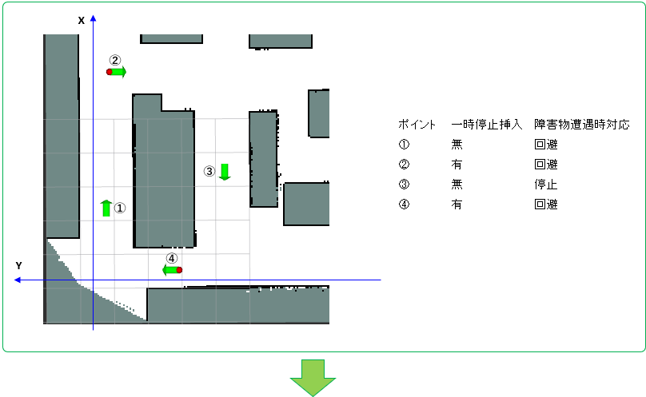  
        経路ファイル(csv)  
        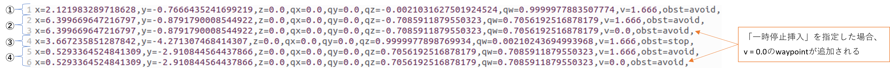  
        * 一時停止設定情報の変更  
            経路設定時にGUI上で「一時停止挿入」を行った場合は、csvファイル上で1つのポイントについて2行分追加される。  
            （速度のパラメータのみ v = 0.0とし、その他座標等の情報が同じ行が2行目に追加される）  
            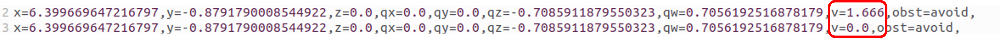  
            よって、経路ファイルの手動の編集で一時停止挿入を追加したい場合は、対象のwaypointの行の下にv = 0.0とした同じデータの行を追加する。  
              
            逆に、一時停止挿入を削除したい場合は、2行目のv = 0.0の行を削除する。  
              
        * 座標・移動速度・障害物遭遇時の動作設定の変更  
            修正対象のwaypointに対応した行のパラメータを変更する。  
            以下に座標・移動速度・障害物遭遇時の対応設定を変更する例を示す。  
            例) 変更内容  
            ・ポイント②のy座標を「-5.0」ずらす。  
            ・ポイント③の障害物遭遇時の対応を「回避」へ変更。  
            ・ポイント④の走行速度を「2.0」へ変更。  
            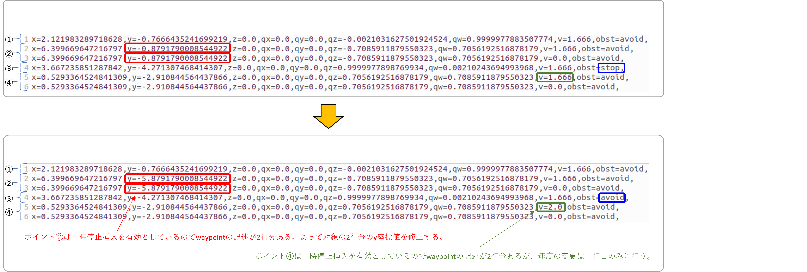

