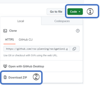
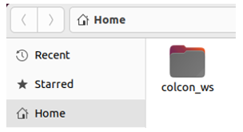
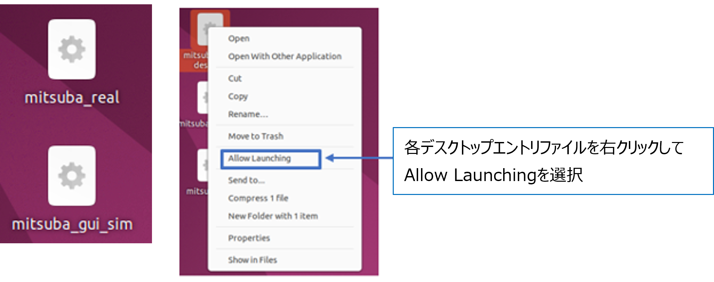

# ミツバ - 移動ロボット用ソフトウェア

## 4. インストール
### 4.1 ROS2および追加パッケージ  
(1)ROS2 Humbleをインストールしてください。(まだ、インストールしていない場合)  
(2)ROS2 Humbleの追加パッケージをインストールしてください。  
```bash
$ sudo apt install ros-humble-ros2-socketcan
$ sudo apt install ros-humble-navigation2
$ sudo apt install ros-humble-nav2-bringup
$ sudo apt install ros-humble-pcl-ros
$ sudo apt install ros-humble-laser-proc
$ sudo apt install sudo apt install festival ※テキスト読み上げに必要
```  
※LiDARパッケージのインストールについて  
　本ソフトウェアでは北陽電機製LiDARを使用するlaunchファイルになっています。  
　北陽電機製の2D-LiDARを使用する場合は、以下のコマンドよりLiDAR用パッケージをインストールできます。  
```bash
$ sudo apt install ros-humble-urg-node
```  
/dev/ttyACM0の権限を変更する必要がありますが、  
下記コマンドでユーザをdialoutグループに追加することにより、  
権限を変更せずに使用できます。  
```bash
$ sudo gpasswd -a $USER dialout
```  
他のLiDARを使用する際は、トピック名を『/scan』、Frame IDを『base_scan』とし、  
launchファイル中のLiDARに関する部分を変更してください。  
### 4.2 ソフトウェア本体  
本ソフトウェアはHumble用となります。  
制御方式によって、ダウンロードするcolcon_wsが異なります。  
Duty制御と回転数PI制御があり、ブランチで分けてあります。  
* Duty制御：指定された出力Duty指令値を目指して一定の変化量でモータを制御します。
* 回転数PI制御：指定された回転数を目指してモータを制御します。  
  
①：Duty制御用colcon_ws  
②：回転数PI制御用colcon_ws  

(1)GithubページからZIPフォルダをダウンロード  
　①のCodeをプルダウンして②のDownload ZIPを押すと  
　colcon_ws、Desktopがダウンロードされます。  
  

(2)ZIPフォルダを解凍して、フォルダをコピー
  * colcon_wsは、HOMEフォルダにコピーしてください。  
  * desktopは、フォルダの中身をデスクトップにコピーしてください。  
  

(3)デスクトップエントリーファイルのAllow Launching化
* mitsuba_realは、実機で手動走行や自律走行をする際に使用します。  
* mitsuba_gui_simは、シミュレーションモデル上で走行する際に使用します。  
  

(4)ワークスペースをコンパイルして、ビルドおよびインストール  
　Terminalを開いて、下記のコマンドを実行してください。  
```bash
$ cd ~/colcon_ws
$ colcon build --symlink-install
```  
(5)USB-CAN変換の有効化  
　デスクトップのUSB-CAN変換の有効化フォルダにあるreadmeを参照してください。


