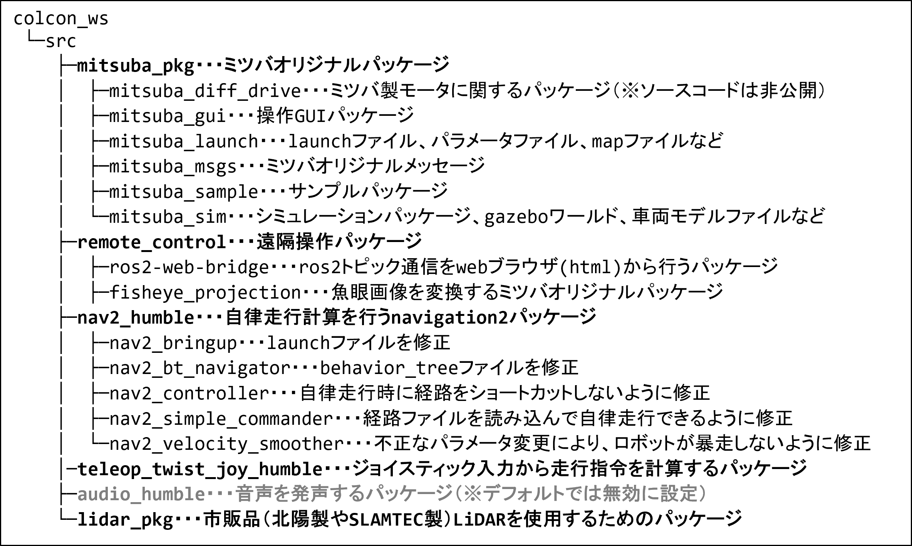

# ミツバ - 移動ロボット用ソフトウェア

## 2. ソフトウェア構成
ミツバが独自に作成したパッケージ「mitsuba_pkg」、  
移動ロボットのナビゲーション機能*を実現する「Navigation2」などのパッケージを基に一部修正を加えた  
複数の依存ライブラリを使用しています。  
※ロボットの自己位置推定、経路計画、障害物回避などの機能
  

## 2.1 当社の独自パッケージ  
ミツバオリジナルのパッケージの詳細は、以下の各リンクを参照してください。　　
* [mitsuba_diff_drive・・・ミツバ製モータに関するパッケージ](https://github.com/MITSUBA-Co/SoftwareForMobileRobots/blob/main/Document/mitsuba_diff_drive.md)  
* [mitsuba_gui・・・操作GUIパッケージ](https://github.com/MITSUBA-Co/SoftwareForMobileRobots/blob/main/Document/mitsuba_gui.md)  
* [mitsuba_launch・・・launchファイル、パラメータファイル、mapファイルなど](https://github.com/MITSUBA-Co/SoftwareForMobileRobots/blob/main/Document/mitsuba_launch.md)  
* [mitusba_msgs・・・ミツバオリジナルメッセージ](https://github.com/MITSUBA-Co/SoftwareForMobileRobots/blob/main/Document/mitsuba_msgs.md)  
* [mitsuba_sample・・・サンプルパッケージ](https://github.com/MITSUBA-Co/SoftwareForMobileRobots/blob/main/Document/mitsuba_sample.md) 
* [mitsuba_sim・・・シミュレーションパッケージ、gazeboワールド、車両モデルファイルなど](https://github.com/MITSUBA-Co/SoftwareForMobileRobots/blob/main/Document/mitsuba_sim.md)  
* [fisheye_projection・・・遠隔操作用の魚眼カメラ画像を変換するパッケージ](https://github.com/MITSUBA-Co/SoftwareForMobileRobots/blob/main/Document/%E9%81%A0%E9%9A%94%E6%93%8D%E4%BD%9C%E6%96%B9%E6%B3%956.md) 

## 2.2 依存ライブラリ  
以下のROS2の依存ライブラリについては、修正または変更している箇所があります。 
詳細は、以下の各リンクを参照してください。  
* [Navigation2パッケージ](https://github.com/MITSUBA-Co/SoftwareForMobileRobots/blob/main/Document/navigation2.md)  
* [teleop_twist_joy](https://github.com/MITSUBA-Co/SoftwareForMobileRobots/blob/main/Document/teleop_twist_joy.md)

