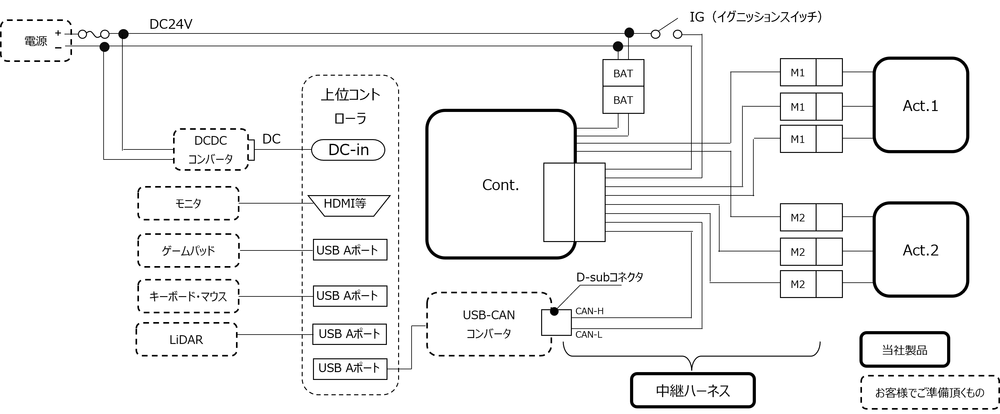

# ミツバ - 移動ロボット用ソフトウェア

## 5. ハードウェアとの接続  
(株)ミツバにて販売するAct.（アクチュエータ）、Cont.（コントローラ）、  
お客様でご準備いただく上位コントローラ、LiDAR、操作I/F（キーボード、マウス、ゲームパッド等）  
を接続します。以下に、ハードウェア構成例を示します。  
* 中継ハーネスのコネクタをCont.とAct.へそれぞれ接続します。  
* 周辺機器（マウス、キーボード、モニタ、ゲームパッド）とLiDARを準備し、上位コントローラと接続します。  
* 上位コントローラにUSB-CANコンバータを接続します。  
* 中継ハーネスのCAN-HとCAN-L線のD-subコネクタをUSB-CANコンバータ側に接続します。  
* (株)ミツバにて販売するAct.（アクチュエータ）、Cont.（コントローラ）の仕様に適合する電源を用意し、  
中継ハーネスの+、－端子を接続します。  
* 使用する上位コントローラに応じて、DCDCコンバータを介して電源に接続します。  
* Cont.（コントローラ）のイグニションスイッチ、上位コントローラの電源スイッチをONにします。  
  
※ 隔操作機能を使用する場合のハードウェア構成例は、「９．遠隔操作方法」の「９．２構成」を参照してください。

