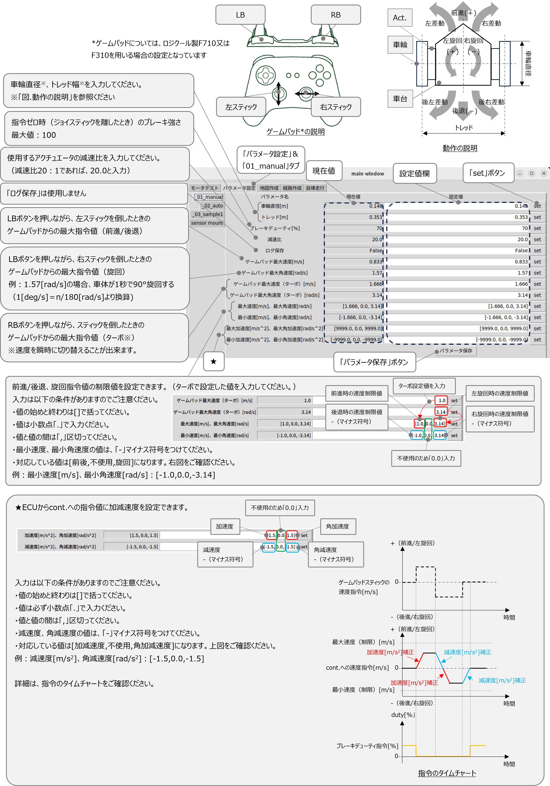

# ミツバ - 移動ロボット用ソフトウェア

## 6. パラメータ設定  
実機で手動走行や自律走行をする際に必要な、ロボットの車輪直径やトレッドなどの設定を行います。  
* デスクトップエントリのmitsuba_realをダブルクリックします。
* 「main window」が立ち上がることを確認します。  
* 「main window」の「パラメータ設定」タブを選択する。  
「01_manual」、「02_auto」、「sensor_mount」の各タブ毎に設定していきます。
* 設定値欄に値を入力し、「set」ボタンを押すことで変更が可能です。  
* パラメータ変更が成功すると、現在値が更新されます。  
* 「パラメータ保存」ボタンを押すことで、次回起動時も変更後の現在値が読みだされます。  
※ 隔操作機能を使用する場合のハードウェア構成例は、「９．遠隔操作方法」の「９．６パラメータ調整」を参照してください。
### 6.1 手動走行時  

