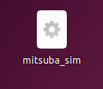
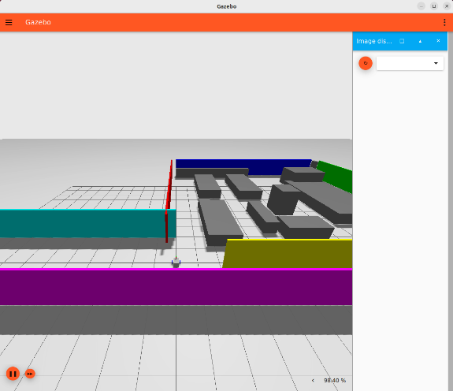
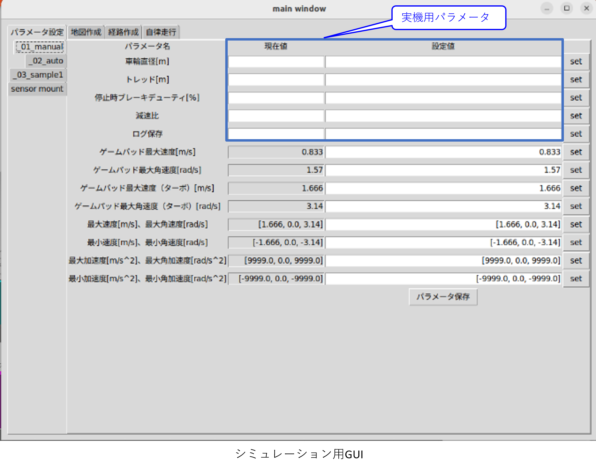

# ミツバ - 移動ロボット用ソフトウェア

## 10. モデルシミュレーション走行方法  
### 10.1 起動/終了  
* シミュレーションの起動  
　mitsuba_simデスクトップエントリーをダブルクリックします。  
  
Ignition Gazebo, シミュレーション用GUIが立ち上がります。  
  
※シミュレーション用GUIについて、  
　実機用GUIとの違いとして  
* モータテストタブがありません。  
* パラメータ設定タブで、実機用パラメータに関する部分が空欄になります。  
  

* シミュレーションソフトの終了  
　ターミナル上でCtrl+Cコマンドを実行し終了します。  

