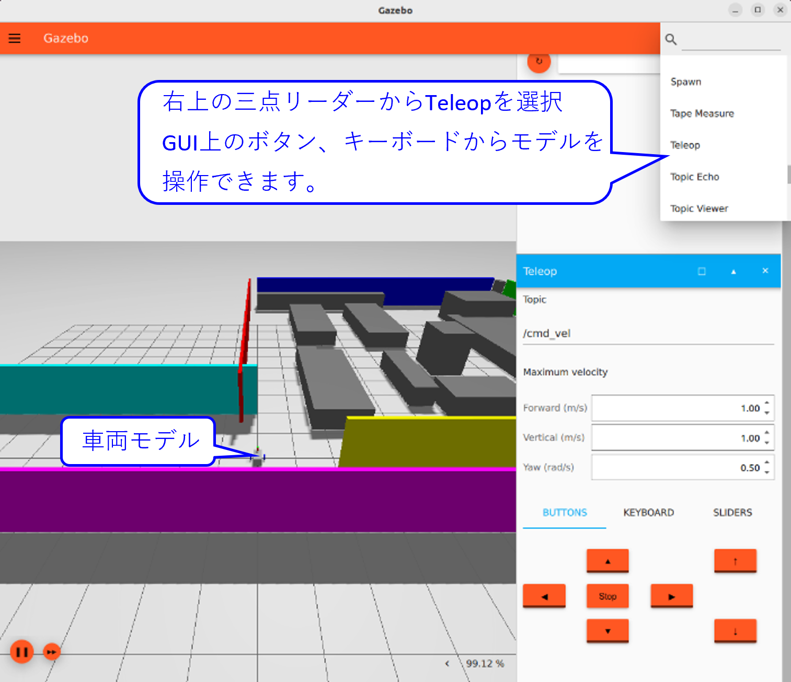
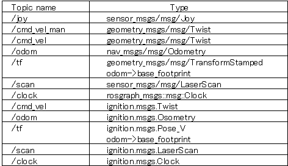
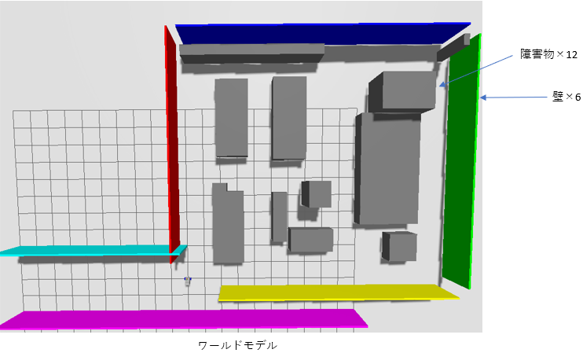
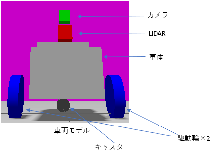

# ミツバ - 移動ロボット用ソフトウェア

## 10. モデルシミュレーション走行方法  
### 10.2 シミュレーションサンプルモデル  
ゲームパッドやGazebo上のGUIから操作することで、車両サンプルモデルを  
手動走行または自律走行させます。  
* 手動走行  
ゲームパッドを用いて実機ロボットの場合と同様の操作で、  
シミュレーションサンプル車両モデルを動作させます。  
また、下図のGazebo上のGUIからも操作可能です。  
  
* 自律走行  
Gazebo上の車両に対して、実機と同様の操作で地図作成と経路設定を行い  
自律走行させることができます。  
* サンプルモデル使用トピック  
  
* サンプルモデル保管場所  
ワールドモデル  
　　colcon_ws>src>mitsuba_pkg>mitsuba_sim>sdf  
車両モデル  
　　colcon_ws>src>mitsuba_pkg>mitsuba_sim>sdf>models  
* モデル構成   
  
 

