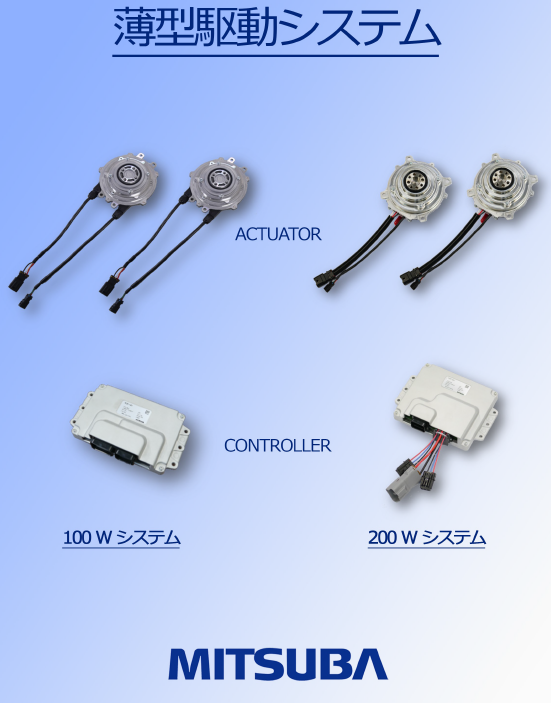

# ミツバ - 移動ロボット用ソフトウェア

## 3. 動作環境
### 3.1 制御コンピュータ  

* プロセッサ: Intel Core i5-1135G または同等以上の性能
* メモリ: 少なくとも 16 GB の DDR4 RAM
* ストレージ: SSD 256 GB 以上
* OS: Ubuntu 22.04  
  　　(Python3.10およびROS2 Humbleのインストールが必要)
* インターフェース：  
　　　　　 |- HDMI 出力  
　　　　　 |- USB 3.0 ポート  
　　　　　 |- Wi-Fi モジュール  

### 3.2 モータ
当社で販売するAct.(アクチュエータ)、Cont.(コントローラ)に対応しています。 
* 仕様： [ミツバの薄型駆動システム](https://pub-mediabox-storage.rxweb-prd.com/exhibitor/document/exh-90dc22af-0d1a-4a6c-83ea-75840197af31/7fd94e7e-bc8f-4ea2-bb2d-9b2caf666c82.pdf)  
  

