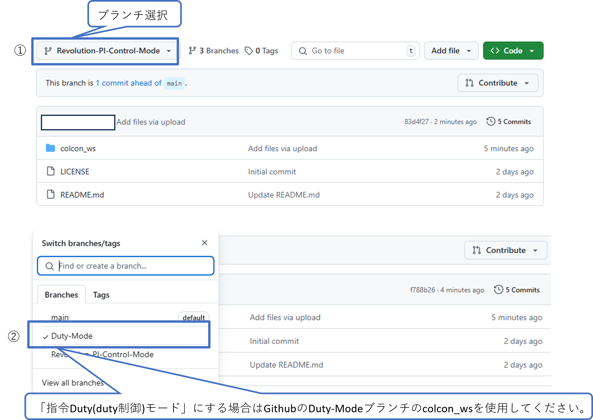

# ミツバ - 移動ロボット用ソフトウェア

## 7. 手動走行方法  
### 7.1 起動/終了  
* デスクトップエントリのmitsuba_realをダブルクリックします。  
* 「main window」が立ち上がることを確認します。  
* 使用後は、「main window」を閉じて終了します。  
### 7.2 ゲームパッドによる操作  
* ゲームパッドのLB（またはRB（ターボ））ボタンを押しながら、スティックを倒すとモータが回転し、離すとモータは停止します。  
Act.を車台に対称に取り付けた場合、以下の動作が出来ます。（図.動作説明を参照ください）  
　　動作1. 左スティックを上下に操作することで、前進/後退します。  
　　動作2. 右スティックを左右に操作することで、旋回動作します。  
　　動作3. 左スティック+右スティックを操作することで、左右のAcｔ.が回転差で動作します。  
  
### 7.3 動作確認
* mitsuba_realが起動していることを確認します。    
* モータ制御モードについて、  
　「指令Duty(duty制御)モード」もしくは「回転数PI制御モード」に切り替え可能となります。  
　モード選択は、「制御モード切替」のプルダウンから行い、「モード切替」ボタンを押すと切替ります。  
  
デフォルトの設定は「回転数PI制御モード」となります。  
「指令Duty(duty制御)モード」にする場合はGithubのDuty-Modeブランチのcolcon_wsを使用してください。  
  
必ず、制御モード切替で制御モードをduty制御にし、モード切替ボタンを押してください。  
  
※モータテスト」タブの画面を選択して表示される「モータ動作指示」や「低電圧アラーム機能」について、  
　使用しません。

