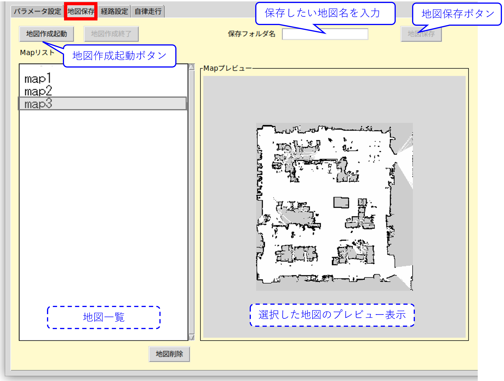

# ミツバ - 移動ロボット用ソフトウェア

## 8. 自律走行方法  
### 8.1 走行地図の作成  
* mitsuba_realが起動していることを確認します。  
* 「main window」の「地図保存」タブを選択して、「地図作成起動」ボタンから地図の作成を開始します。  
ここで、create_map.launchが呼ばれ、SLAM地図作成時に必要なノード類が立ち上がります。 
* 自律走行させたい領域内でロボットを手動走行させます。  
* 生成できた地図をROS2付属の可視化ツールrviz2ウィンドウで確認します。  
生成した地図が問題無いようであれば、mitsuba_realの「main window」に切り替え  
「地図保存」タブの画面上のEntryボックス内に地図名を入力して地図保存ボタンを押します。  
~/colcon_ws/src/mitsuba_pkg/mitsuba_launch/map以下に、指定した名前のフォルダが作成され、  
フォルダ内に地図ファイル（map.yaml, map.pgm, map.posegraph, map.data）が保存されます。  
尚、既に存在する地図フォルダ名を指定するとエラーとなります。  
* 「地図作成終了」ボタンを押して終了します。  
  

※地図リストの表示について、  
　~/colcon_ws/src/mitsuba_pkg/mitsuba_launch/map以下に存在する地図フォルダが  
　Mapリストに表示されます。  
　また、不要な地図を選択して、「地図削除」ボタンから削除が可能です。  
  
※地図プレビューの表示について、  
　Mapリスト上で任意の地図を選択すると、Mapプレビューに地図が表示されます。

