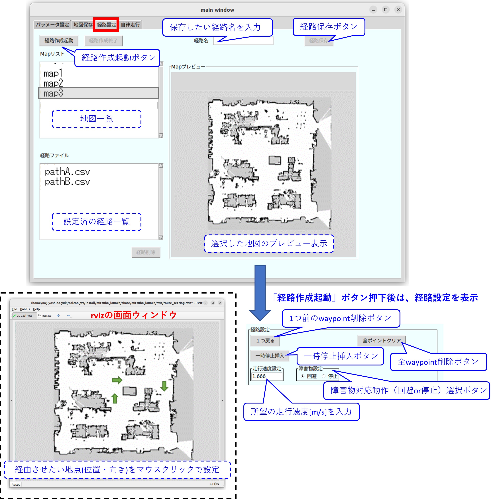

# ミツバ - 移動ロボット用ソフトウェア

## 8. 自律走行方法  
### 8.2 走行経路の設定  
* mitsuba_realが起動していることを確認します。  
* 「main window」の「経路設定」タブを選択します。   
* Mapリストから経路作成対象の地図を選択します。  
* 「経路作成起動」ボタンから経路の設定を開始します。  
ここで、route_setting.launchが呼ばれ、経路設定時に必要なノード類が立ち上がります。  
また、地図プレビュー部分が経路設定用の表示に切り替わります。    
* 経路設定は、rvizツールの画面ウィンドウ上で行います。  
rviz画面に表示される地図上をマウスでクリックしてウェイポイントの位置と向きを設定します。  
* rviz上での経路設定後、mitsuba_real「main window」の画面上にてEntryボックス内に  
任意の経路名を入力して「経路保存ボタン」を押します。  
~/colcon_ws/src/mitsuba_pkg/mitsuba_launch/map/(選択した地図フォルダ)以下に、  
指定した名前で経路（csv）ファイルが保存されます。  
尚、既に存在する経路ファイル名を指定するとエラーとなります。  
* 「経路作成終了」ボタンを押して終了します。  
  

※1つ前のwaypoint削除ボタンについて、  
　「1つ戻る」ボタンを押すとrviz上で最後に設定したwaypointを1つ消すことができます。  

※一時停止挿入ボタンについて、  
　「一時停止挿入」ボタンを押すと最後に設定したwaypointを一時停止として設定できます。  
　尚、一時停止を挿入した経由点の矢印には赤丸の表示が追加されます。  
  

※走行速度設定について、  
　「走行速度設定」Entryボックスに所望の走行速度[m/s]を設定します。  

※障害物対応動作について、  
　「障害物設定」ラジオボタンで障害物に遭遇した時の動作（回避または停止）を設定します。

