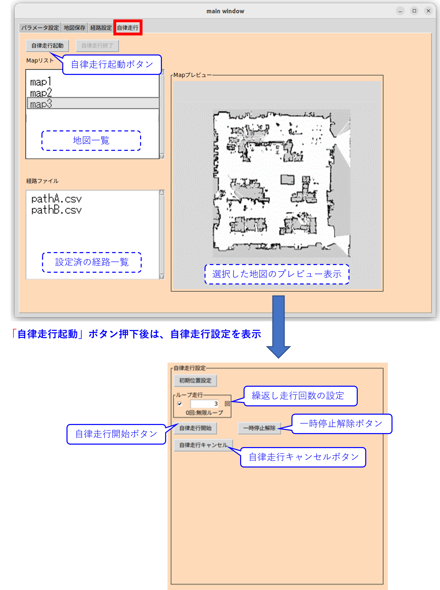

# ミツバ - 移動ロボット用ソフトウェア

## 8. 自律走行方法  
### 8.3 自律走行操作  
* mitsuba_realが起動していることを確認します。  
* 「main window」の「自律走行」タブを選択します。   
* Mapリストから自律走行させたい地図を選択します。  
* 「自律走行起動」ボタンを押します。  
ここで、auto_run_slamtoolbox.launchが呼ばれ、自律走行に必要なノード類が立ち上がります。  
また、地図プレビュー部分が自律走行操作用の表示に切り替わります。  
（「自律走行終了」ボタンを押すと地図プレビュー表示に戻ります。）
* 設定済の経路一覧から所望の経路ファイルを選択します。   
* ロボットを自律走行地図の初期位置（走行開始地点）に配置します。    
* 「自律走行開始」ボタンが有効となるので、ボタンを押して自律走行を開始します。  
* 自律走行を終了する際は、「自律走行キャンセル」ボタンを押します。  
  

※一時停止解除ボタンについて、  
　経路ファイルで設定された一時停止ポイントで停止している時に押すと、自律走行を再開できます。  

※繰り返し走行について、  
　「自律走行開始」ボタンを押す前にループ走行有効/無効チェックボックスにチェックを入れて  
　Entryボックスに所望の反復回数を入力します。  
　ループ走行有効状態でループ回数を0回と設定した場合は、設定した経路の走行を無限に繰り返します。

