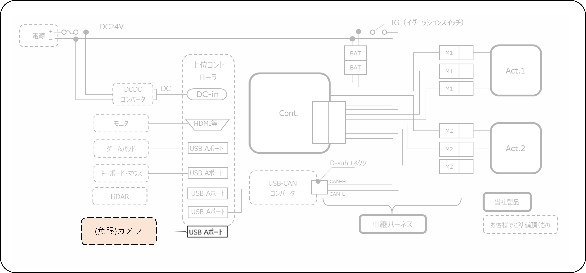
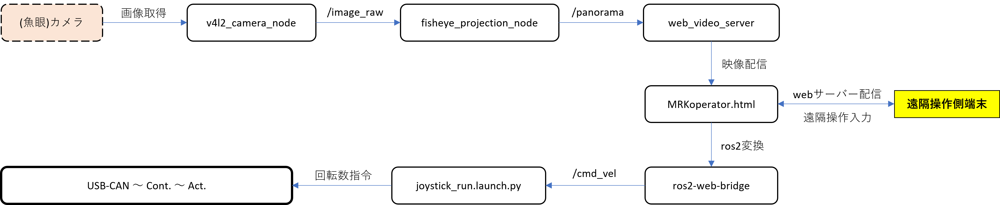

# ミツバ - 移動ロボット用ソフトウェア

## 9. 遠隔操作方法  
### 9.2 構成  
### ハードウェア構成
ロボット側  
  

### 操作端末側  
省略(必要に応じてタッチパッド・キーボード・マウス・ゲームパッド)  
### ソフトウェア構成  
ロボット側  
　mitsuba_remote_control.launch.py  
　　起動用ローンチファイル(デスクトップエントリ「mitsuba_remote_control」から起動)  

　Node.js  
　ros2-web-bridge  
　　ros2トピック通信をwebブラウザ(html)から行う  

　web-video-server  
　　ros2トピックで配信されている画像をwebブラウザで表示する  

　fisheye_projection(ミツバ独自パッケージ)  
　　魚眼画像を変換する  

　v4l2_camera  
　　カメラから画像を取得しros2トピックで配信する(同様の機能があればv4l2_cameraに限らない)  

　MRKoperator.html  
　　webサーバから配信するwebブラウザ内容  

　joystick_run.launch.py  
　　走行制御(詳細略)  
   
### 操作端末側  
webブラウザのみ使用

