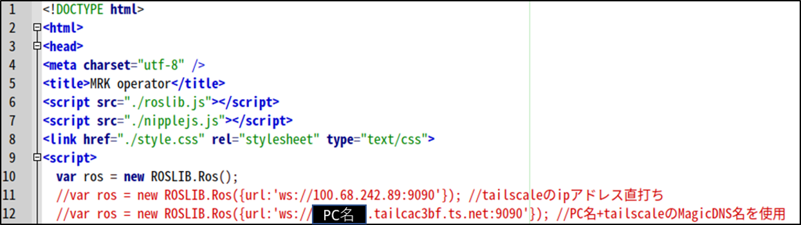

# ミツバ - 移動ロボット用ソフトウェア

## 9. 遠隔操作方法  
### 9.3 通信  
### ネットワーク構築  
* ロボット側PC内に建てたwebサーバーに遠隔操作端末から接続する必要があります。  
* 何らかの方法でグローバルIP環境で接続したり、VPN接続などを用います。  
* 外部ネットワークからの動作確認は個人使用では無料のTailscaleを用いてVPN接続を行います。  
### 通信準備  
MRKoperator.html内にロボット側PCのコンピュータ名やIPアドレスを記述します。  
  
ロボット側PC内で複数のサーバーが建ち、お互いに認識するために使用  
※VPN接続にtailscaleを使用する際の例
  

