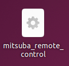
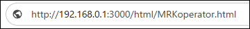

# ミツバ - 移動ロボット用ソフトウェア

## 9. 遠隔操作方法  
### 9.4 起動/終了  
### 遠隔操作起動方法  
　ロボット側  
　　デスクトップエントリー「mitsuba_remote_control」を起動して準備完了です。  
   

　操作端末側  
　　ロボット側PCのIPアドレス(またはPC名)を把握します。  
　　※端末はwebブラウザを開くことが出来ればPCだけでなくスマートフォンやタブレットでも動作可能です。  
　　webブラウザを開き、アドレス欄に「http://○○○.○○○.○○○.○○○:3000/html/MRKoperator.html」を入力します。  
　　　○：ロボット側IPアドレス(192.168.0.1など)に置き換えます。  
  
### 遠隔操作終了方法  
ロボット側  
　　 ターミナルの右上☓で閉じます。  
操作端末側  
　　webブラウザの右上☓で閉じます。

