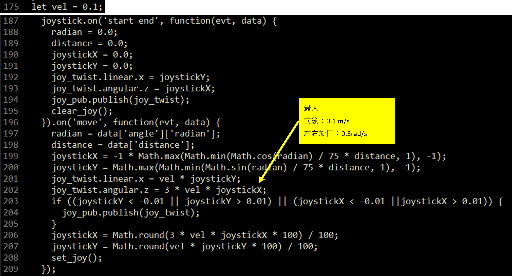

# ミツバ - 移動ロボット用ソフトウェア

## 9. 遠隔操作方法  
### 9.6 パラメータ調整  
以下のファイルを編集して調整します。  
### MRKoperator.html  
* スティック操作時の速度、角速度  
* 速度up、速度downボタンの刻み  
* ゲームパッド、キーボード入力のボタン割り当て  
* カメラ配信映像表示サイズ、画質設定  
* その他必要に応じてROS2トピック通信変数宣言  
* スティック操作時の速度、角速度  
  
* 速度up、速度downボタンの刻み  
  
* ゲームパッド、キーボード入力のボタン割り当て  
  
* カメラ配信映像表示サイズ、画質設定  
  
* その他必要に応じてROS2トピック通信変数宣言  
  
### fisheye_projection_node.cpp  
* カメラパラメータ(歪み係数、カメラ行列)設定  
* 変換範囲設定  
* カメラ画像合成  
* ズーム、視線方向変更の倍率設定  
* ロボット幅黄色線表示  
* カメラパラメータ(歪み係数、カメラ行列)設定  
  
* 交換範囲設定  
  
* カメラ画像合成  
  
* ズーム、視線方向変更の倍率設定  
  
* ロボット幅黄色線表示  
  

